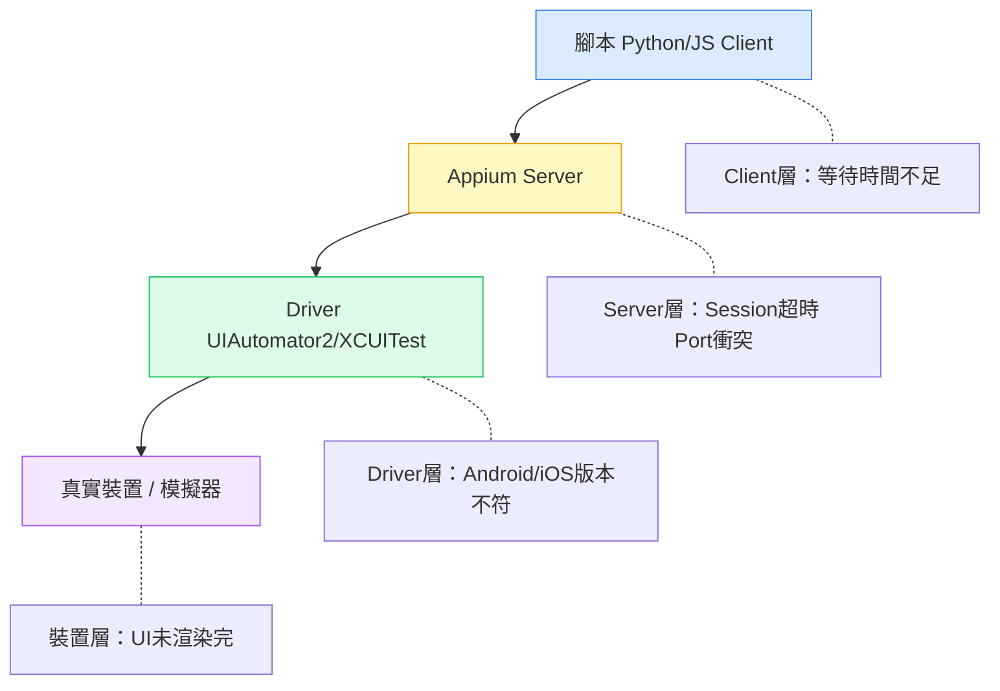

# 那次 CI 全紅，我才搞懂 Appium 到底在做什麼

> 改寫草稿｜原文：從 Appium 架構到元件定位

---

## 目錄

1. [開頭：一個讓我找兩天的 bug](#開頭)
2. [我當時怎麼理解 Appium（錯的）](#當時的理解)
3. [架構其實在說一件事](#架構)
4. [Locator 不是查表選的，是踩過才懂的](#locator)
5. [我現在的做法](#現在怎麼做)
6. [結尾](#結尾)

---

## 開頭

那天 CI 跑了一半，測試全紅。

錯誤訊息是 `NoSuchElementException`，但我明明在本機跑得過。我以為是裝置問題，重啟了三次。以為是 app 版本，rollback 再跑。最後發現是我的 XPath locator 裡面寫死了一個 index，本機 app 的 layout 層數跟 CI 裝置差一層。

找了將近兩天。

那個當下我才開始認真去看 Appium 的架構，不是因為想學，是因為被打臉了。

---

## 當時的理解

我一開始把 Appium 當成一個黑盒子：我寫指令，它操作手機，測試通過就好。

架構？不重要。只要 `driver.find_element` 能找到東西就行。

這個想法讓我在之後半年踩了很多坑：
- flaky test 出現找不到原因
- 同一支腳本在不同裝置行為不一樣
- XPath 寫得越來越長，越來越脆

問題不是 Appium 不穩定，是我根本不知道我的指令在系統裡經過了哪些層。

---

## 架構

Appium 的指令從你的 Python 腳本出發，經過這條路：



每一層都可能出問題，但你的錯誤訊息通常只告訴你最後一層發生了什麼。

知道這個有什麼用？當你的 test 掛掉，你可以問自己：
- 是 Client 端的問題（腳本邏輯、等待時間）？
- 是 Server 端（session 超時、port 衝突）？
- 是 Driver 端（Android / iOS 版本不符）？
- 是裝置本身（UI 沒渲染完、動畫還在跑）？

這四個問題讓我的 debug 時間從「亂試」變成有方向。

---

## Locator

這是真正讓我改變做法的部分。

我以前的選擇邏輯是：能用就好。XPath 最靈活，所以我幾乎全部用 XPath。

現在我的順序完全不同：

**1. resource-id / ID — 先找這個**

如果 RD 有設，直接用。最穩，最快，沒有懸念。

```python
driver.find_element(AppiumBy.ID, "com.app:id/btn_start")
```

**2. Accessibility ID — 跨平台首選**

iOS 和 Android 都能用同一個 locator，前提是 RD 有設 accessibilityLabel。
值得跟 RD 溝通，這個習慣建立起來之後測試穩定很多。

```python
driver.find_element(AppiumBy.ACCESSIBILITY_ID, "start_button")
```

**3. XPath — 最後手段，不是第一選擇**

我現在寫 XPath 之前會問自己：有沒有辦法不用？

XPath 沒有不好，但它跟 UI 結構綁死了。RD 改了一個 ConstraintLayout 的嵌套，你的 XPath 可能就壞了，而且不會有任何警告。

如果非用不可，寫法要盡量不依賴 index：

```python
# 這樣容易壞
//android.widget.LinearLayout[2]/android.widget.TextView[1]

# 這樣好一點
//android.widget.TextView[@text='開始計時']
```

**4. Coordinates — 幾乎不用**

只有一種情況我會用：元素根本無法被任何 locator 抓到（某些 canvas 元件）。
用了就記得留 comment，不然三個月後你自己也看不懂那個數字是什麼。

---

## 現在怎麼做

我現在在寫 locator 之前會做一件事：打開 uiautomatorviewer 或 Appium Inspector，先看這個元件有沒有 resource-id。

有 → 直接用  
沒有 → 去問 RD 能不能加  
RD 說不行 → 看有沒有 accessibility ID  
還是沒有 → 才考慮 XPath，而且要寫最短路徑

這不是一個漂亮的流程圖，就是我踩過坑之後形成的習慣。

---

## 結尾

我現在看到有人把 Appium 說得很複雜，或者反過來說「只要會 find_element 就夠了」，都覺得說的不完整。

它就是一個翻譯層。你越清楚指令從哪裡出發、經過哪些手、最後在哪裡執行，越容易在出問題的時候找到正確的那層去看。

Locator 的選擇也一樣。沒有最好的策略，只有當下條件下最合理的決定。

我還在學，這篇只是我目前的理解。

---

*如果你有不同的做法或踩過其他坑，歡迎留言。*
