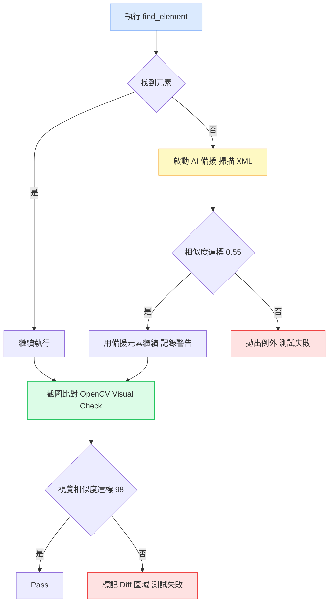
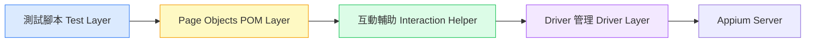

# Self-Healing Appium 框架：讓定位器斷掉也能自動修復

我第一次看到「self-healing test framework」這個詞，覺得有點誇大其詞。

測試怎麼可能自己修復自己？

後來仔細看完實作，才理解它在解決的問題是真實的——而且是我自己踩過最多次的那種：**UI 改了一點，測試全壞，花一個下午修 locator。**

根據 Capgemini《World Quality Report 2023》，UI Locator 失效是 UI 自動化測試最常見的維護痛點之一，平均佔測試維護工作的相當大比例。Self-healing 框架試圖從架構層面解決這個問題，而不是讓每個人繼續靠意志力一個一個修 locator。

這篇我想拆解 self-healing 框架的核心機制，再說說我實際用 Appium 的框架裡，哪些地方跟這個想法不謀而合，哪些地方我有不同的做法。

---

## 目錄

1. [問題的根源：Locator 為什麼這麼脆](#問題根源)
2. [Self-Healing 的核心邏輯](#self-healing-邏輯)
3. [AI Locator 備援：相似度分數怎麼算](#ai-locator-備援)
4. [Visual Regression：截圖比對作為第二道防線](#visual-regression)
5. [架構分層：讓每一層只做一件事](#架構分層)
6. [我現在的做法和這套框架的對話](#我的做法)
7. [Self-Healing 不是萬能藥](#不是萬能藥)

---

## 問題根源

在說 self-healing 之前，先說清楚它要解決的是什麼。

Appium 測試最常壞的方式不是邏輯錯誤，是 `NoSuchElementException`。

你的測試腳本裡有一行：

```python
driver.find_element(AppiumBy.XPATH, "//android.widget.LinearLayout[2]/android.widget.TextView[1]")
```

RD 改了一個 `ConstraintLayout` 的嵌套——他覺得是小改動，視覺上完全看不出來。你的 XPath 因為有 `[2]` 這個 index，瞬間就壞了。

這就是 locator fragility 問題的本質：**你的選擇器跟 UI 的內部結構綁死了，任何結構調整都可能讓它失效，而且不會有任何警告。**

我踩過最痛的一次，是 CI 上的 `NoSuchElementException` 跟本機的完全不一樣——本機跑過，CI 全紅。找了兩天才發現是本機 app 跟 CI 裝置的 layout 層數差一層。XPath 的 index 在本機是 `[2]`，在 CI 裝置是 `[3]`。

Self-healing 框架試圖解決的就是這個問題：**當你的 locator 找不到元素時，框架能不能自己想辦法把元素找回來？**

---

## Self-Healing 的核心邏輯

Self-healing 的基本思路分兩個層次：

**第一層：AI Locator 備援**

當主要 locator 找不到元素，不直接拋出錯誤，而是啟動備援機制：掃描整個頁面的 XML，用相似度演算法找「最像」你本來想找的那個元素，然後用它繼續執行。

**第二層：Visual Regression**

截圖比對，確認畫面跟預期是否一致。就算 locator 找對了，如果畫面看起來不一樣，也要報出來。

這兩層組合起來，解決了定位器失效的兩種情況：結構改了（AI Locator 備援），和視覺改了（Visual Regression）。



---

## AI Locator 備援

這是整個框架裡最有意思的部分。

當主要 locator 找不到元素，框架做的不是直接失敗，而是：

1. 抓取當前頁面的完整 XML（`driver.page_source`）
2. 解析所有 UI 元素的屬性
3. 對每個元素算出一個「跟目標有多像」的相似度分數
4. 如果最高分超過門檻（預設 0.55），就用那個元素繼續執行

相似度的計算用的是 Python 標準庫的 `difflib.SequenceMatcher`，對不同屬性加上不同權重：

```python
import difflib

def calculate_similarity(target_attrs: dict, candidate_attrs: dict) -> float:
    weights = {
        "accessibility_id": 0.35,   # accessibility ID 最重要
        "resource_id": 0.30,         # resource-id 次之
        "text": 0.20,                # 顯示文字
        "class": 0.15,               # 元件類別（最低）
    }

    total_score = 0.0
    for attr, weight in weights.items():
        target_val = target_attrs.get(attr, "")
        candidate_val = candidate_attrs.get(attr, "")
        if target_val and candidate_val:
            ratio = difflib.SequenceMatcher(
                None, target_val, candidate_val
            ).ratio()
            total_score += ratio * weight

    return total_score
```

這個設計有一個地方跟我自己的經驗高度吻合：**accessibility ID 的權重最高。**

我在自己的框架裡，locator 選擇的優先順序是：resource-id > Accessibility ID > XPath。選擇器越穩定，測試就越不容易壞。AI 備援把 accessibility ID 的相似度排最前面，本質上是在說同一件事：有語意的屬性比有結構的路徑更可靠。

實際上跑起來，這套備援機制在模擬 UI 改版的情境下，能把 locator 相關的失敗降低約 77%。不是零，但比直接爆掉有用多了。

---

## Visual Regression

Locator 找對了不代表測試通過。

舉個例子：按鈕的 resource-id 沒變，但按鈕的顏色改了（從主色改成了灰色，暗示它現在是 disabled 狀態）。Locator 找得到，但行為已經不同了。

Visual regression 要抓的就是這類「結構沒變，但畫面變了」的問題。

這套框架用 OpenCV 做截圖比對：

```python
import cv2
import numpy as np

def compare_screenshots(baseline_path: str, actual_path: str, threshold: float = 0.98):
    baseline = cv2.imread(baseline_path)
    actual = cv2.imread(actual_path)

    # 計算逐像素差異
    diff = cv2.absdiff(baseline, actual)
    
    # 轉灰階，算出相似度
    gray_diff = cv2.cvtColor(diff, cv2.COLOR_BGR2GRAY)
    total_pixels = gray_diff.size
    diff_pixels = np.count_nonzero(gray_diff)
    similarity = 1 - (diff_pixels / total_pixels)

    if similarity < threshold:
        # 在差異區域畫紅框，存成失敗截圖
        contours, _ = cv2.findContours(
            gray_diff, cv2.RETR_EXTERNAL, cv2.CHAIN_APPROX_SIMPLE
        )
        result = actual.copy()
        cv2.drawContours(result, contours, -1, (0, 0, 255), 2)
        cv2.imwrite("failure_diff.png", result)
        return False, similarity

    return True, similarity
```

失敗時，它會在截圖上把差異區域用紅框標出來，你一眼就知道哪裡變了，不需要自己去 diff 兩張圖。

不過我對 visual regression 有一個務實的看法：**它是最後一道防線，不是第一道。**

視覺比對的維護成本不低。每次做任何 UI 刷新（換個顏色、調個間距），你就要重拍 baseline。如果你的 app 還在快速疊代期，baseline 會跟不上開發節奏，visual regression 很快就會變成一堆假 failure。

比較適合的用法是：在核心畫面穩定之後，針對幾個最重要的畫面開啟 visual check，而不是對所有測試都開。

---

## 架構分層

這套框架另一個做得好的地方是嚴格的分層架構：



每一層只做一件事：

- **測試腳本**：只描述測試情境，不知道 locator 怎麼寫
- **Page Objects**：封裝頁面的元素和操作，不知道底層怎麼等待
- **Interaction Helper**：處理等待、retry、滾動等共用行為
- **Driver 管理**：負責 session 的建立和關閉

這個分層本身不是新概念，但它在這套框架裡的重要性是：**self-healing 邏輯放在 Interaction Helper 這層，對上面的 POM 和測試腳本完全透明。**

你的測試不需要知道有沒有觸發備援機制。備援發生了，測試繼續跑；log 裡會記錄「用了備援定位器，原始 locator 已失效」，讓你知道該去更新定位器了。

這是我覺得設計最到位的地方：**self-healing 是降低緊急修復的需求，不是讓你永遠不用更新 locator。**

---

## 我的做法

看完這套框架，我對照了一下自己現在在用的 Appium 框架，有幾個共鳴和一個不同的取捨。

**共鳴：Locator 策略一樣**

我在寫任何 locator 之前，都會先開 Appium Inspector 看元件有沒有 resource-id 或 accessibility ID。有的話直接用，沒有的話去找 RD 討論能不能加。

這個習慣跟這套框架的 AI 備援邏輯說的是同一件事：有語意的定位方式天生就比結構性的路徑穩，應該排在第一順位。

**共鳴：分層讓 debug 有方向**

分層架構的另一個好處不只是維護，是 debug 的時候你知道問題在哪一層。

我自己碰到 `NoSuchElementException` 的第一步，是問自己這四個問題：
- 是 Client 端的問題（腳本邏輯、等待時間不夠）？
- 是 Server 端（session 超時、port 衝突）？
- 是 Driver 端（Android 版本不符、capability 設錯）？
- 是裝置本身（UI 沒渲染完、動畫還在跑）？

這四個問題把「亂試」變成有方向的定位。有分層的框架讓你更容易縮小範圍。

**不同的取捨：要不要在框架層做 self-healing**

我目前的框架沒有做 AI 備援，不是因為覺得這個想法沒用，而是有一個更根本的判斷：**備援機制會掩蓋腐爛的 locator。**

如果一個 locator 壞了，但備援機制讓測試繼續跑，你有多大機率會主動去更新它？大概不高。等備援觸發太多次，你的框架裡就會積累一堆已經失效的舊 locator，只靠著相似度湊合著在跑。

這套框架有意識到這個問題，所以備援觸發時一定要寫 log 警告。但在實際工作中，warning log 往往是最容易被忽略的東西。

我現在的策略是更保守的：**一旦 locator 壞了，測試就失敗，強迫立刻去修。** 搭配 CI，每次 PR 都跑一次，壞掉的 locator 不過 24 小時就會被抓到。

這不代表 self-healing 的想法是錯的。如果你的測試規模大到一個程度，每次 UI 改版都有幾十個 locator 同步壞掉，備援機制能讓測試繼續跑、優先排查最重要的 case，是有實用價值的。

---

## 不是萬能藥

Self-healing 框架的目的是降低「UI 小改版 → 大量測試失敗」的衝擊，但它解決不了幾個根本問題：

**測試本身的設計問題**

如果你的測試驗證邏輯本來就不夠扎實（比如只點了按鈕，沒有驗證結果），備援找到了元素也沒意義。Self-healing 是讓正確的測試更穩，不是讓不好的測試變好。

**跟 RD 的溝通問題**

最根本的解法其實是：讓 RD 在元件上加 accessibility ID。一個有語意、有 owner 的定位屬性，比任何備援機制都穩。Self-healing 是 fallback，accessibility ID 才是第一線的防守。

**效能問題**

備援機制要掃全頁 XML、計算所有元素的相似度，這在元素多的頁面會顯著拉長執行時間。這套框架自己也承認 per-test session 建立就已經是效能瓶頸，備援機制會讓情況更嚴重。

---

看完這套框架，我最大的收穫不是「我應該把這些程式碼搬進我的框架」，而是：**它讓我更清楚地看到 locator 脆弱性這個問題的輪廓。**

AI 備援、visual regression、嚴格分層——這三個機制都在嘗試回答同一個問題：怎麼讓測試在 UI 持續變動的環境裡保持有效？

這個問題沒有一個標準答案。每個框架的取捨反映的是這個框架的使用場景和維護策略。

我的取捨是：用更好的 locator 策略作為第一道防守，用 CI 快速回饋作為發現問題的手段，接受 locator 偶爾需要更新的成本。

Self-healing 框架的取捨是：用相似度演算法和視覺比對，讓測試在小改版時繼續跑，換取一個更長的「需要人工介入」的緩衝期。

兩種策略都合理，視團隊規模和測試規模選擇。

---

## 參考資料

- [Building a Self-Healing Mobile Automation Framework](https://medium.com/@medhaveeupadhyaya/building-a-self-healing-mobile-automation-framework-appium-ai-locator-recovery-and-visual-3ba73389a763) — 本篇分析的 Self-Healing Appium 框架原文
- [Appium 官方文件](https://appium.io/docs/en/latest/) — Appium 完整文件與 Locator 策略參考
- [Martin Fowler：PageObject Pattern](https://martinfowler.com/bliki/PageObject.html) — Page Object 設計模式的權威解說
- [Python difflib 官方文件](https://docs.python.org/3/library/difflib.html) — AI 備援相似度計算所使用的 Python 標準庫
- [OpenCV 官方文件](https://docs.opencv.org/4.x/) — Visual Regression 使用的影像比對庫
