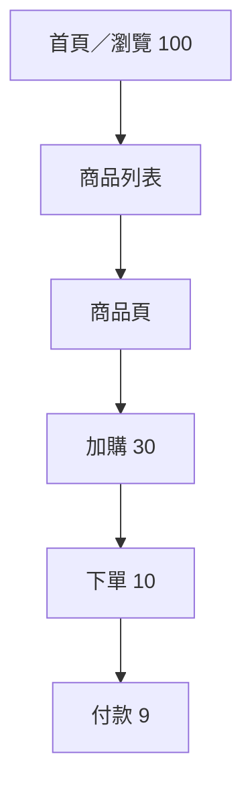

# 流量模型：總量對了，不代表測對了

你算出了大促的目標 TPS，把它灌進系統，全綠燈。然後上線就崩。

問題在哪？**總量對了，但流量的組合錯了。** 把一坨均勻的流量灌進去，跟真實用戶的行為差了十萬八千里。建一個貼近真實的流量模型，是壓測有沒有意義的分水嶺。

## 一、用漏斗推各 API 的比例

真實用戶會走一條旅程：首頁 → 商品列表 → 商品頁 → 加購 → 下單 → 付款。每一層都會流失一些人，所以各 API 的流量比，大致是各層轉化率的連乘。

舉例：100 個人瀏覽，30 個加購，10 個下單，9 個付款。這個遞減的形狀，就是你壓測各介面該有的比例。把所有 API 都壓成 1:1，本身就不真實。

## 二、讀寫比：少量的寫，往往才是瓶頸

電商常見的讀寫比是 95:5 甚至 99:1——讀遠多於寫。但別被這個比例騙了：**寫的代價遠高於讀**（要加鎖、要保一致性）。那少少的 5% 寫入，很可能才是壓垮系統的點。所以壓測不能因為「寫很少」就忽略它。

## 三、熱點：把流量集中打到爆品

大促流量不是均勻灑的，它高度集中在少數爆品 SKU。建模時要用權重分佈（80-20：少數品項佔掉多數流量）讓少數 SKU 拿走多數請求；秒殺場景甚至要集中到單一 SKU。

這一步做不對，後果很嚴重。看兩個真實反例：

- 所有虛擬用戶都搜同一個關鍵字 → 全部命中快取，QPS 衝很高，但後端資料庫其實**零壓力**，測了個寂寞。
- 所有下單都打同一個 SKU → 行鎖瞬間爆掉，但這是你的腳本造成的「假崩潰」，不是真實分佈（除非你本來就是要測秒殺單品）。

## 四、參數化資料要真實

腳本用的測試資料也要貼近真實：

- 帳號池要夠大，避免所有請求都用同一個帳號，撞鎖、撞限流。
- SKU 池要照熱點權重抽樣，而不是平均。
- 避免全部打同一筆資料，造成假瓶頸或假的快取命中。

## 流量模型 = 比例 + 分佈 + 資料

記住這個公式：一個能用的流量模型，**比例對、分佈對、資料對**，三件事缺一不可。

那這些數字哪裡來？最好的來源是**生產環境的日誌或 APM**——撈出真實的 API 佔比、SKU 訪問分佈，按比例還原。拿不到的話，就用漏斗轉化率估，但記得標明這是假設（千萬別把 28 比例之類的當定律硬套）。
