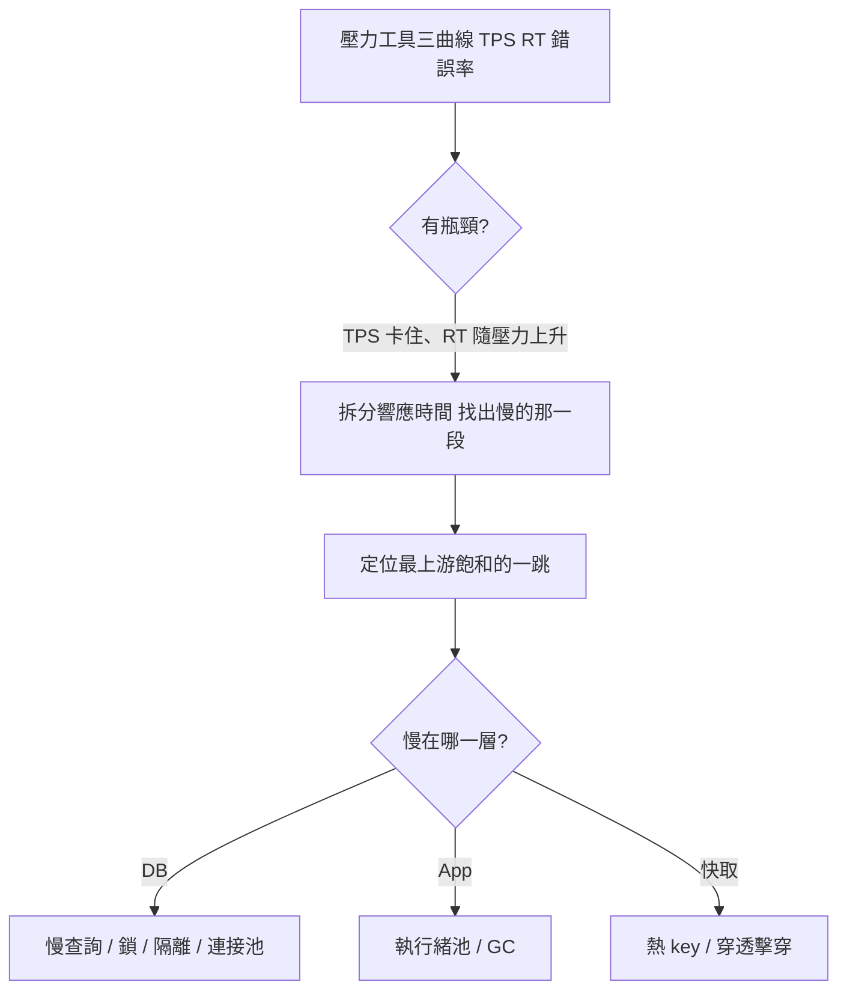

# 瓶頸定位是偵探工作

系統慢了，新手的反應通常是開始猜：加索引？上 Redis？分庫分表？加機器？然後憑感覺改一通，改完沒用再換下一個。

這是賭博，不是定位。資深的效能工程師把瓶頸分析當成一門偵探功夫，這篇就帶你建立這套方法論。

## 先看能力階梯

可以把性能分析的能力分成四階：

```
工具操作 → 數值理解 → 趨勢/相關性/證據鏈分析 → 調優
```

多數人卡在中間兩階：會跑工具，但看不懂計數器；看得懂計數器，但串不起它們之間的邏輯關係。而「**證據鏈分析**」——把各個數值的因果串起來——才是最值錢的一環。

## 分析決策樹：三步定位



1. **判斷有沒有瓶頸**：看 TPS、響應時間、錯誤率三條曲線。TPS 上不去、RT 隨壓力爬升，就是瓶頸訊號。記住：**TPS 判容量，RT 判業務快慢**。
2. **拆分響應時間**：一個請求跨了閘道、應用、資料庫、快取……要拆出時間到底耗在哪一跳。手段有 Nginx / Tomcat 的日誌、鏈路監控工具（SkyWalking）、甚至抓包。一個「應用 + 資料庫」的簡單架構，都能拆出 8 段時間。
3. **深入那一跳**：對飽和的資源看利用率、飽和度、錯誤。

## 小心「連鎖偽裝」

定位最容易被騙的地方，是一層的問題偽裝成另一層的。

例：應用 CPU 不高卻很慢 → 一查，時間都耗在「等資料庫連接」→ 再查，是某支慢查詢拖住連接遲遲不放 → 根因其實是缺了一個索引。

表面看像「應用連接池不足」，根因卻在資料庫。所以要**順著證據鏈往上游推，找到第一個飽和的資源**，而不是在受害者那層瞎修。

## 分層地圖：每層先看什麼

| 層 | 典型瓶頸 | 先看的指標 |
|----|---------|-----------|
| 負載平衡 / 閘道 | 連接數上限、限流 | 連接數、5xx、佇列 |
| 應用 | 執行緒池 / GC / 連接池 | 執行緒池佔用、GC、池等待 |
| 快取 | 熱 key、命中率掉 | 命中率、熱 key、RT |
| 訊息佇列 | 堆積、消費慢 | 堆積數、消費速率 |
| 資料庫 | 慢查詢、鎖、連接 | 慢查詢、鎖等待、連接數 |
| 第三方 | 限流、逾時 | 外呼 RT、錯誤率 |

## 兩個心法

- **先定位，再優化。** 沒有數據支撐的調優就是賭博。
- **瓶頸判斷要細到「具體計數器的值是多少」。** 有個經典場景：瓶頸出現時，DBA 說 CPU 90% 沒問題、開發說是 DB 索引問題，各執一詞——直到有人把執行計畫攤出來，才講得清楚。

最後一句送給每個做效能的 QA：**只測不調，那只是性能驗證，不是完整的性能項目。**
