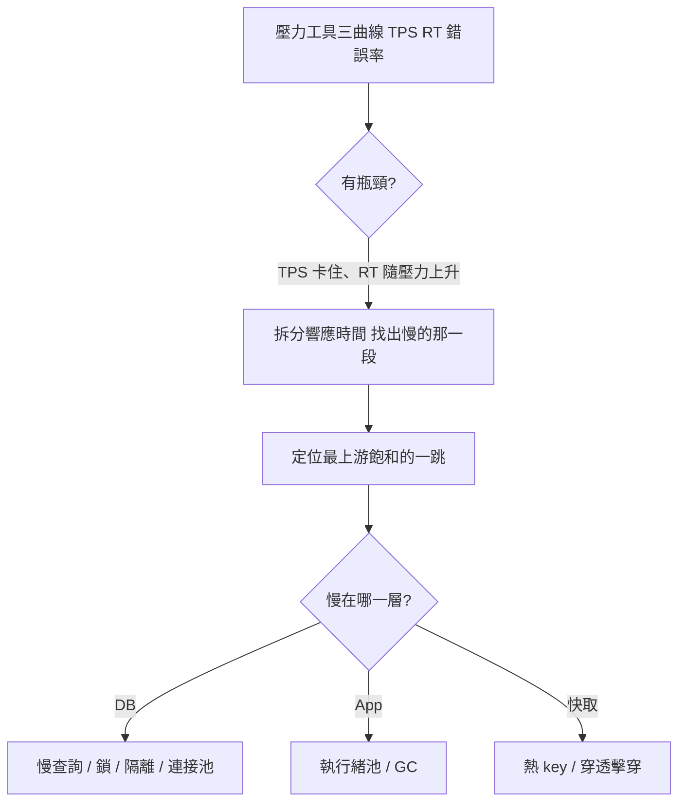
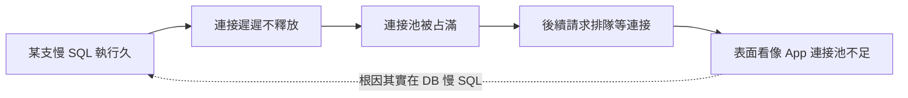

# 雙11 當天，第一個倒下的為什麼總是資料庫？

活動 00:00 開賣，下單介面開始大量逾時。你打開監控，應用伺服器的 CPU 才用到四成、記憶體一堆空閒——機器明明很閒，但 TPS 就是卡在一個低點，怎麼加壓都上不去。

這個畫面我看過太多次，而且劇本幾乎一樣：壓測環境裡一切正常，TPS 達標、P99 在 SLA 內，報告一片綠燈；一上線就崩。

為什麼？因為在高併發電商場景，**第一個倒下的幾乎永遠是資料庫**。

原因很簡單：應用層要加機器很容易，水平擴一排就好；但資料庫是整條鏈路裡最難水平擴展、又必須保證資料一致的那一層。流量的洪水，最後都會匯到這個最窄的瓶口。

這篇文章要做的，就是把「資料庫慢」這四個字拆開，帶你走完一次真實的定位流程。

## 先別猜，先定位

新手最容易犯的錯，是一看到「DB 慢」就開始猜：是不是要加索引？要不要分庫分表？要不要上 Redis？然後憑感覺改一通，改完沒用，再換下一個猜測。

效能分析有一句被反覆強調的鐵律：**先定位，再優化**。沒有數據支撐的調優就是賭博。

他的「分析決策樹」方法論其實很簡單：先用壓力工具的三條曲線判斷有沒有瓶頸，再把時間拆開，順著證據鏈找到第一個飽和的資源。

這裡有個關鍵心法：**TPS 判斷容量有多大，響應時間判斷業務有多快。** 當你看到 TPS 上不去、響應時間卻隨壓力一路爬升，這就是典型的瓶頸訊號。

接下來要做的不是猜，而是把時間拆出來。如果時間都耗在「等資料庫回應」這一段，那才輪到我們深入 DB。

還有一句話，我想送給每個做效能的 QA：**只測不調，那只是性能驗證，不是完整的性能項目。** 報一個壓力工具看到的 RT、給個通過不通過就收工，等於把自己的價值砍掉一半。

瓶頸的判斷要能細化到「具體是哪個計數器、值是多少」——這樣你跟 RD、DBA 對話時才有底氣。

## DB 瓶頸的四種長相

定位到資料庫這一層之後，常見的瓶頸大致是四類。

### 一、慢查詢：被資料量放大的問題

慢查詢是最常見、也最好抓的。打開慢查詢日誌，對可疑的 SQL 跑一次 `EXPLAIN` 看執行計畫；全表掃描、沒吃到索引、大量回表、額外的排序或暫存表，都是常見元兇。

這裡有個最容易被忽略的陷阱：**資料量是最大的隱形變數。** 測試庫只有幾千筆，少了索引照樣飛快；但生產是億級資料表，同一支 SQL 從 2ms 變成 2s 是家常便飯。

我看過一個案例：活動查詢因為缺了一個複合索引，在億級訂單表上全表掃描，單支 SQL 把連接池整個占滿，最後全站逾時——加上索引之後秒解。

所以壓測前的造數，資料量級一定要對齊生產，不然你測的是一個跟線上完全不同的系統。

### 二、鎖：那個「CPU 很閒卻卡住」的兇手

這是最反直覺、也最值得 QA 搞懂的一類。

回到開頭的秒殺現場：應用 CPU 才四成，為什麼 TPS 卡死？答案是 **行鎖競爭**。

秒殺的爆品庫存就是同一行資料，成千上萬個請求都要 `UPDATE` 它、扣它的庫存，InnoDB 的行鎖逼著這些請求一個一個排隊、序列化處理。CPU 沒事做（它在等鎖），但吞吐就是上不去。**「TPS 卡死但 CPU 不高」，幾乎就是鎖競爭的簽名。**

關於 InnoDB 的鎖，有幾件事 QA 一定要知道：

- **Record Lock 鎖的是索引，不是記錄本身。** 如果更新條件沒吃到適用的索引，InnoDB 可能鎖住更大範圍、甚至退化成接近表鎖。一個沒設計好的索引，在高併發下會從「查得慢」升級成「整張表卡住」。
- **間隙鎖（Gap Lock）與 Next-Key Lock。** MySQL 預設的可重複讀（RR）下，InnoDB 用「記錄鎖 + 間隙鎖」組成 Next-Key Lock（前開後閉的區間）來解決幻讀。代價是範圍 `FOR UPDATE` 或範圍更新會鎖住「間隙」，**阻塞其他事務在這個範圍插入新資料**，壓測時表現成寫入集體排隊。
- **死鎖** 多半來自多個事務沒按同一順序存取、交錯加鎖。對策是事務內按固定順序存取物件、把大事務拆小。

### 三、隔離級別與 MVCC：壓測前要分清讀寫路徑

很多人壓測把讀和寫混在一起灌，結果定位不出問題。要先記住一件事：**碰鎖的是「當前讀」，不是「快照讀」。**

MySQL 的 MVCC（多版本並發控制）讓普通 `SELECT` 走 **快照讀**——讀的是 Undo Log 裡的舊版本快照，**完全不加鎖**。這就是為什麼讀多寫少的場景，可以靠 MVCC 扛住極高的併發讀。

但 `INSERT`、`UPDATE`、`DELETE`，以及加了 `FOR UPDATE`、`LOCK IN SHARE MODE` 的查詢，走的是 **當前讀**——要讀最新版本而且要加鎖。秒殺的庫存扣減就是典型的當前讀，鎖競爭就發生在這裡。

還有一個常被忽略的調優點：**隔離級別越高，鎖的範圍越大。** 報表、讀多的查詢其實不需要預設的 RR，降到提交讀（RC）就能少掉很多間隙鎖、放寬並發。別一律用預設值。

### 四、連接池：偽裝成「應用慢」的連鎖反應

最後這個最會騙人。現象是：應用 CPU 沒滿、DB CPU 也沒滿，但請求就是慢——因為它們全卡在「等一條資料庫連接」。

這往往是連鎖反應的尾端：慢查詢拖住連接遲遲不放，後面的請求排隊等連接，表面像「應用層連接池不夠」，根因其實在 DB 那支慢 SQL。

這就是為什麼前面要強調「順著證據鏈找最上游的飽和點」——你以為的問題層，常常只是別人問題的受害者。

所以連接池要監控三個數字：**使用率、等待數、洩漏**（借了不還）。連接洩漏特別陰險，壓測短時間看不出來，要靠浸泡測試跑久了才現形——連接數只增不減，最後耗盡。

## 那要怎麼壓測這些問題？

理解了瓶頸的長相，壓測腳本就要刻意去「複製」它，而不是灌一堆均勻流量：

- **熱點要還原**：秒殺就是要把流量集中打到單一爆品 SKU，才壓得出行鎖競爭。腳本若把請求平均分散到上萬個 SKU，行鎖根本不會發生，壓測一片綠燈、上線立刻翻車。
- **資料量要對齊生產**：不然慢查詢永遠不會現形。
- **讀寫路徑要分清**：要壓鎖競爭，就得壓「當前讀」（下單、扣庫存），不是壓快照讀（瀏覽商品）。
- **浸泡測試別省**：連接洩漏、長事務累積這類問題，短時壓測抓不到。

## 收尾：幾個帶得走的判斷

- 高併發下 DB 常是第一個瓶頸，因為它最難擴展又要保一致性。
- **先定位再優化**：三曲線判斷瓶頸 → 拆時間 → 找最上游飽和點，別憑感覺猜。
- **「TPS 卡死但 CPU 不高」= 鎖競爭**；這是行鎖序列化最典型的簽名。
- Record Lock 鎖的是索引——**爛索引在高併發下不只是慢，是會鎖住一片**。
- 碰鎖的是當前讀，不是快照讀；壓測要分清讀寫路徑。
- 連接池打滿，常常是別層問題的受害者，要順證據鏈找根因。

下一篇接著講：當你確定瓶頸在「同一行庫存的鎖競爭」之後，秒殺的庫存扣減到底該怎麼設計，才能既不超賣又扛得住——從 DB 行鎖、Redis 預扣到 MQ 異步落庫的演進。
