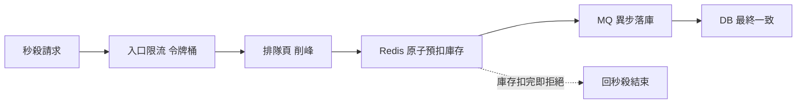

# 秒殺專題：高併發的極限考題

秒殺把前面所有的觀念逼到極限：瞬間尖峰、熱點集中到單一 SKU、強一致的庫存扣減、鎖競爭……全擠在一起。搞定秒殺，等於把這門課的東西串起來用一遍。

## 超賣的根因

超賣幾乎都來自同一個問題：`讀庫存 → 判斷 → 扣減` **不是原子操作**。高併發下，多個請求同時讀到同一個庫存值、都判斷「還有貨」、都扣——於是賣超了。

## 庫存扣減方案的演進

| 方案 | 機制 | 取捨 |
|------|------|------|
| DB 行鎖 / 樂觀鎖 | `UPDATE ... WHERE stock>0` 原子扣 | 簡單，但單行鎖序列化，TPS 受限 |
| Redis 預扣 | 用原子操作（Lua / DECR）先扣快取 | 高 TPS，但要跟 DB 對帳 |
| Redis 預扣 + MQ 異步落庫 | 快取扣減 + 異步寫 DB | 高吞吐、最終一致，主流方案 |

第一招最直觀但會卡在 DB 行鎖（就是前面 DB 篇講的「TPS 卡死但 CPU 不高」）；演進到 Redis 預扣把扣減搬到記憶體、再用訊息佇列異步落庫，是現在的主流。

主流方案的請求流大致長這樣：

## 削峰、排隊、預熱、防刷

- **削峰**：排隊頁 + 訊息佇列，把瞬時的百萬請求平滑成後端能處理的速率。
- **排隊 / 限流**：入口限流（令牌桶）、單用戶單 SKU 限購、答題或驗證碼把尖峰拉長分散。
- **預熱**：活動前把商品、庫存、頁面先載入快取與 CDN，避免開賣瞬間冷快取被擊穿。
- **防刷**：限頻、風控、驗證碼，擋掉機器人放大真實尖峰。

## 怎麼壓測秒殺

這部分最容易做錯，把前面的觀念合起來用：

- 用**開放模型**（固定到達率）灌瞬時尖峰——封閉模型會因為系統一慢就自動縮壓力，壓不出真實雪崩。
- **熱點集中到單一 SKU**——平均分散的流量根本碰不到行鎖競爭。
- 驗證三件事：不超賣、排隊不雪崩、預扣與 DB 最終一致對得起來。

這裡要特別提醒：秒殺是少數允許**線程突增**的場景，但前提是**系統已經預熱過**；如果你模擬不出開賣瞬間的陡增，這個壓測場景就是不合理的。還有那句老話——描述容量永遠用 TPS，不是壓力工具的線程數；線程再多，對已達 TPS 上限的系統也只是徒增 RT。

如果預熱沒做，後果是：開賣瞬間冷快取，萬筆請求一起擊穿打到資料庫，資料庫秒崩。
