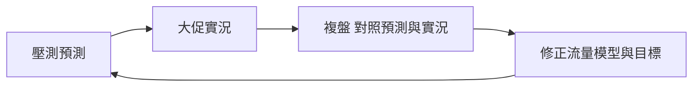

# 大促壓測不該是一年一次的消防演習

很多團隊的效能測試，是大促前才臨時抱佛腳壓一輪，靠幾個資深的人英雄式救火。這種模式撐不住長期——人會累、會走，問題會反覆出現。效能要變成**可持續的工程能力**，得常態化。

## 效能左移

把效能檢查往開發階段移。關鍵 API 在開發、PR 階段就跑輕量的效能檢查，及早發現退化。

道理很簡單：在 PR 階段抓到一個退化，成本比大促前才壓出來便宜千倍。

## 接進 CI：用門檻擋退化

把效能測試接進 pipeline：

- 用輕量工具（例如 k6）在 CI 跑基準場景。
- 設**效能門檻（quality gate）**：P95、錯誤率、吞吐超過閾值就讓建置失敗，直接擋住會退化的合併。
- 跟基線比較，報「相對上次 ±X%」。

一個真實的價值場景：某次重構讓核心 API 的 P95 從 120ms 變成 400ms，CI 的效能門檻直接擋下來——沒讓它流到大促才爆。

## 效能看板：抓「溫水煮青蛙」

長期追蹤關鍵交易的 RT 百分位、吞吐、錯誤率趨勢，配異常告警，留歷史基線可回溯。

看板最能抓到的，是那種「每週 P99 漲一點、三個月後翻倍」的緩慢退化——這種「溫水煮青蛙」型的問題，單看任何一次壓測都正常，只有趨勢圖看得出來。

## 大促複盤：形成閉環

活動結束別急著收工，要把這次的經驗回饋到下一輪：

1. 對照「壓測預測 vs 線上實況」——流量模型準不準？尖峰倍率對不對？
2. 用線上真實流量數據，修正下一輪的流量模型。
3. 把這次的瓶頸與修復，沉澱成 checklist 與回歸用例。

例如：上次預估尖峰 10 倍、實際 18 倍，那下一輪的模型倍率就要上修，壓測上限跟著調。

## 一句收尾

有句話值得貫穿整門課：**要有自己可複用的分析邏輯，而不是經歷多少個性能問題。** 常態化的本質，就是把每一次複盤沉澱成可複用的東西——讓效能不再靠英雄，而是靠系統。

到這裡，從術語、規劃、腳本、執行、定位到複盤，這趟效能測試的旅程就走完一圈了。而它其實是個圓：複盤校準的目標與模型，又回到了第一課的起點。
