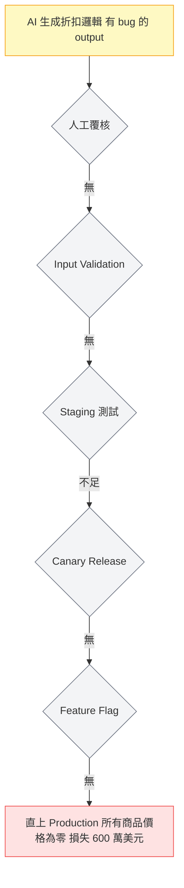

# AI 取代 12 人 QA 團隊，銀行損失 600 萬的故事

---

## 目錄

1. [事件始末](#事件始末)
2. [後續更諷刺](#後續更諷刺)
3. [技術上，哪裡出錯了](#技術上哪裡出錯了)
4. [什麼是 AI 測不出來的](#什麼是-ai-測不出來的)
5. [這不是反 AI，是反「無人監管」](#這不是反-ai)

---

## 事件始末

2026 年 4 月，一則推文在測試圈裡炸開了。

發文者 @shazcodes 描述了一個他親身經歷的案例：某家金融公司在 2026 年初決定解散整個 12 人的 QA 部門，改用 AI 驅動的自動化測試系統取代。

管理層算了一筆帳：省下每年 120 萬美元的人力成本，AI 系統 24 小時不停跑測試，聽起來很划算。

結果不到幾個月，事情就發生了。

AI 自動化系統生成了一個有問題的折扣碼邏輯，這個邏輯在沒有人工覆核的情況下被直接推上生產環境。折扣碼把所有產品的價格設成了零。

客戶發現之後，訂單湧入。公司損失了約 **600 萬美元**的營收。

---

## 後續更諷刺

事情最諷刺的部分還沒結束。

災難發生後，這家公司的 CEO 聯絡了其中一位被資遣的資深 QA 工程師，請他幫忙排查問題。

**不付薪水。**

這則消息在社群上引發大量討論，矛頭指向這場決策背後的治理問題和責任歸屬。被你裁掉的人，在你出事之後你才想起他的價值——但你不打算為這個價值付錢。

---

## 技術上，哪裡出錯了

這起事故的直接原因是一個 AI 系統的邏輯錯誤，但事故能造成 600 萬損失，是因為多層防線同時失效了：

| 失效的防線 | 應有的作用 | 這次缺失的後果 |
|------------|------------|----------------|
| 人工覆核 | QA 理解業務邏輯，判斷輸出是否合理 | 折扣碼邏輯異常沒人察覺 |
| Input Validation | 程式層面阻擋不合理的值（如價格 ≤ 0） | 任何值都直接寫入 |
| Staging 測試 | 在非生產環境先跑一遍，觀察實際效果 | 跳過或不夠嚴謹 |
| Canary Release | 先推給 1–5% 使用者，異常就回滾 | 直接 100% 上線 |
| Feature Flag | 出問題可以瞬間關閉功能 | 沒有緊急開關 |

每一道防線都不是 AI 負責的——它們是工程流程的設計，而流程的設計需要人。

---

## 什麼是 AI 測不出來的

這起事故有一個核心問題：**折扣碼把商品價格設為零，這件事 AI 的測試套件沒有認定它是「錯的」。**

為什麼？因為 AI 不知道「商品不應該免費」這件事。

這是業務邏輯（business logic），是公司運作的規則，不是程式碼的規則。AI 只懂你告訴它的東西——你的 prompt、你的 test spec、你的規格書。如果你沒有明確寫「price > 0」，AI 不會主動替你補上這個假設。

QA 工程師之所以能抓到這種問題，是因為他們理解業務，他們看到「全部免費」的第一反應是：**等等，這不對。**

這種「不對」的直覺，建立在：

- **產品知識**：知道這個功能在業務流程中的角色
- **歷史記憶**：知道這類邏輯過去發生過什麼問題
- **風險直覺**：金融場景下，任何跟金額有關的邏輯都要多看一眼
- **對「正常」的感知**：使用者看到這個畫面，會有什麼反應

這些東西沒辦法用 prompt 傳給 AI。

---

## 這不是反 AI

我不是要說 AI 不應該用在測試上。

AI 在測試領域確實有用：生成測試案例的骨架、補全邊界值、寫 API 測試腳本、做基礎的回歸驗證。這些事 AI 做得快、做得多，是好事。

但這起事故要說的是另一件事：

> **「讓 AI 做測試」和「讓 AI 取代判斷力」是兩件事。**

這家公司做的不是前者，是後者。他們把 AI 當成一個可以自己負責品質的系統，拿掉了所有人工判斷的環節——沒有人看測試結果是否合理，沒有人在上線前問「這個折扣邏輯對嗎」，沒有人在出問題時能第一時間介入。

這不是 AI 的問題，是流程設計的問題，是治理的問題。

削減成本不是壞事，但你削的如果是「判斷力」，那你省下的 120 萬，可能正在某個地方等著用 600 萬的方式還給你。

---

## 給 QA 的實際啟示

如果你也在公司裡面對「AI 化之後 QA 人力是否還需要這麼多」的討論，這個案例可以幫你說清楚 QA 的價值不在哪裡、在哪裡：

**不在** 機械性執行測試步驟（這個 AI 確實可以做）

**在：**
- 判斷「這個行為合不合理」
- 在 spec 沒寫清楚的地方主動提出疑問
- 理解業務風險，決定哪些東西不能出錯
- 設計防線——不只是測試案例，而是 validation、staging、canary、rollback 策略

這次出事的金融公司，少的不是測試數量，是少了一個人在看測試結果時說：

「等等，價格怎麼是零？」

---

*來源：[AI replaces QA team and triggers $6m loss - QA Financial](https://qa-financial.com/ai-replaces-qa-team-and-triggers-6m-loss-do-banks-risk-losing-judgement/)*
