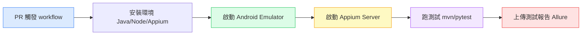

# 把 Appium 測試串進 GitHub Actions，讓手機測試自動跑

---

## 目錄

1. [為什麼 Appium 測試最需要 CI](#為什麼需要-ci)
2. [整體架構：三個零件怎麼串在一起](#整體架構)
3. [Step 1：啟動 Android Emulator](#step-1)
4. [Step 2：啟動 Appium Server](#step-2)
5. [Step 3：跑測試，收集結果](#step-3)
6. [完整 workflow YAML](#完整-yaml)
7. [測試報告發布到 GitHub Pages](#測試報告)
8. [幾個踩過才懂的細節](#踩過才懂)

---

## 為什麼 Appium 測試最需要 CI

Appium 測試有一個特性：每次手動跑都很麻煩。

你要先確認 emulator 有沒有開著、Appium server 有沒有跑起來、測試環境有沒有乾淨、有沒有上一次跑的殘留狀態。光是準備環境，就能花掉五分鐘。

所以很多人的 Appium 測試最後變成「偶爾手動跑一下」，而不是「每次改 code 都跑」。

這就是 CI 要解決的事：**把環境準備、測試執行、結果回報，全部自動化。**

每次 PR，GitHub Actions 啟動一台乾淨的虛擬機，自動把 emulator 開起來、Appium server 跑起來、測試跑完、結果上傳。你不需要碰任何東西。

---

## 整體架構：三個零件怎麼串在一起



三個核心零件：

1. **`reactivecircus/android-emulator-runner`**：幫你在 GitHub Actions 的 Linux runner 上啟動 Android emulator（需要 KVM 加速）
2. **Appium server**：在背景跑，讓測試腳本可以連上去操作 emulator
3. **你的測試腳本**：pytest / Maven / 任何你用的框架

---

## Step 1：啟動 Android Emulator

GitHub Actions 的 Linux runner 支援 KVM 硬體加速，這讓 Android emulator 可以正常跑。但要先開啟 KVM：

```yaml
    - name: 開啟 KVM 加速
      run: |
        echo 'KERNEL=="kvm", GROUP="kvm", MODE="0666", OPTIONS+="static_node=kvm"' \
          | sudo tee /etc/udev/rules.d/99-kvm4all.rules
        sudo udevadm control --reload-rules
        sudo udevadm trigger --name-match=kvm
```

然後用 `android-emulator-runner` 這個 action 啟動 emulator，並在 emulator 裡執行測試：

```yaml
    - name: 啟動 Emulator 並執行測試
      uses: reactivecircus/android-emulator-runner@v2
      with:
        api-level: 34          # Android 版本
        target: google_apis    # 有 Google Play 的 image
        arch: x86_64
        profile: Nexus 6
        script: |
          # 在這裡放你要跑的指令
          # emulator 啟動後才會執行
          adb devices
          bash ./scripts/run_tests.sh
```

`script` 裡的指令會在 emulator 完全啟動後才執行，不用自己加 sleep 等待。

---

## Step 2：啟動 Appium Server

Appium server 要在跑測試之前啟動，通常用背景執行的方式：

```yaml
    - name: 安裝 Appium
      run: |
        npm install -g appium@latest
        appium driver install uiautomator2

    - name: 啟動 Appium Server（背景）
      run: |
        appium --log appium.log &
        # 等 Appium 起來再繼續
        sleep 5
        curl -f http://localhost:4723/status || exit 1
```

`curl -f http://localhost:4723/status` 是在確認 Appium 真的起來了，而不是假設 sleep 5 秒就一定夠。如果 Appium 沒起來，這一步會失敗，整個 workflow 就停在這裡，不會跑到測試然後給你一堆莫名其妙的錯誤。

---

## Step 3：跑測試，收集結果

**Python + pytest：**

```yaml
    - name: 跑 Appium 測試
      run: |
        pytest tests/ -v \
          --alluredir=./allure-results \
          || true
```

**Java + Maven：**

```yaml
    - name: 跑 Appium 測試
      run: |
        mvn test \
          -Dsurefire.suiteXmlFiles=src/test/resources/testng-suite.xml \
          || true
```

`|| true` 讓測試失敗時 workflow 繼續跑（而不是直接中止），這樣後面的報告上傳步驟才能執行。測試結果仍然會被記錄為失敗，PR 的 check 也會顯示紅燈。

---

## 完整 workflow YAML

```yaml
name: Appium Android Tests

on:
  pull_request:
    branches: [main, develop]

jobs:
  android-tests:
    runs-on: ubuntu-latest

    steps:
      - name: Checkout
        uses: actions/checkout@v4

      - name: 安裝 Java
        uses: actions/setup-java@v4
        with:
          java-version: '17'
          distribution: 'temurin'

      - name: 安裝 Node.js
        uses: actions/setup-node@v4
        with:
          node-version: '20'

      - name: 安裝 Python（如果用 pytest）
        uses: actions/setup-python@v5
        with:
          python-version: '3.11'

      - name: 安裝 Appium
        run: |
          npm install -g appium@latest
          appium driver install uiautomator2

      - name: 安裝測試相依套件
        run: pip install -r requirements.txt

      - name: 開啟 KVM 加速
        run: |
          echo 'KERNEL=="kvm", GROUP="kvm", MODE="0666", OPTIONS+="static_node=kvm"' \
            | sudo tee /etc/udev/rules.d/99-kvm4all.rules
          sudo udevadm control --reload-rules
          sudo udevadm trigger --name-match=kvm

      - name: 啟動 Emulator 並跑測試
        uses: reactivecircus/android-emulator-runner@v2
        with:
          api-level: 34
          target: google_apis
          arch: x86_64
          profile: Nexus 6
          script: |
            appium --log appium.log &
            sleep 5
            curl -f http://localhost:4723/status || exit 1
            pytest tests/ -v --alluredir=./allure-results || true

      - name: 上傳測試結果
        uses: actions/upload-artifact@v4
        if: always()
        with:
          name: allure-results
          path: allure-results/
          retention-days: 14

      - name: 上傳 Appium log（debug 用）
        uses: actions/upload-artifact@v4
        if: always()
        with:
          name: appium-log
          path: appium.log
```

---

## 測試報告發布到 GitHub Pages

跑完測試只有 artifact 不夠直覺，可以加一個 job 把 Allure report 發布到 GitHub Pages，讓每次 PR 都有一個可以點開的測試報告連結：

```yaml
  deploy-report:
    needs: android-tests   # 等測試跑完
    runs-on: ubuntu-latest
    if: always()

    steps:
      - name: 下載測試結果
        uses: actions/download-artifact@v4
        with:
          name: allure-results
          path: allure-results/

      - name: 產生 Allure Report
        uses: simple-elf/allure-report-action@master
        with:
          allure_results: allure-results
          allure_report: allure-report
          keep_reports: 20

      - name: 發布到 GitHub Pages
        uses: peaceiris/actions-gh-pages@v3
        with:
          github_token: ${{ secrets.GITHUB_TOKEN }}
          publish_dir: allure-report
```

設定好之後，每次測試跑完，GitHub Pages 就會有一份 Allure 報告，可以直接在 PR 裡貼連結給 RD 看。

---

## 幾個踩過才懂的細節

**1. emulator 啟動很慢，第一次可能要等 3–5 分鐘**

GitHub Actions 的 runner 速度比本機慢，emulator 啟動時間要預留。`android-emulator-runner` 有內建等待邏輯，但第一次跑可能會讓你以為它卡死了——它在慢慢開。

**2. `if: always()` 很重要**

上傳 artifact 的步驟一定要加 `if: always()`，否則測試失敗時這一步會被跳過，你就看不到失敗的原因。

**3. Appium log 要存起來**

CI 環境的測試比本機更容易出現奇怪的問題（device 連線、capability 不對、timing 問題）。把 `appium.log` 存成 artifact，失敗時可以直接翻 log，不用靠猜的。

**4. `|| true` 不等於測試通過**

加了 `|| true` 的測試指令，workflow 不會因為測試失敗就整個中止，但 GitHub 最終的 check 狀態還是會根據測試結果顯示紅燈。這個設計是為了讓「收集報告」的步驟在測試失敗時也能執行。

---

Appium 測試串進 CI 之後，最明顯的變化是：你不再是測試的瓶頸。RD 推 code，測試自動跑，不需要有人記得去觸發。

這是這系列[上一篇](/blog/appium-2-to-3-migration)升完 Appium 3 之後的自然下一步。

---

*參考資料：[From Zero to CI/CD: Appium with GitHub Actions](https://medium.com/@clarkewertonSilva/from-zero-to-ci-cd-appium-mobile-testing-with-github-actions-and-allure-reports-1fd984a9a5c8) ／ [GitHub Actions 官方文件](https://docs.github.com/en/actions)*
