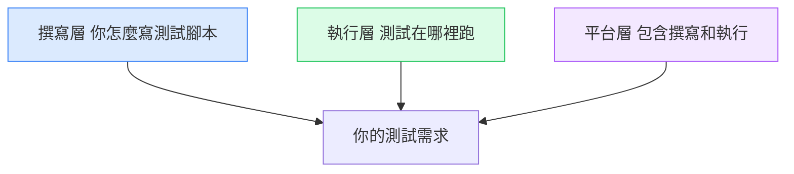

# 為什麼 74% 的團隊同時用多個測試框架

---

## 目錄

1. [一個框架不夠的真正原因](#一個不夠)
2. [三層測試需求，三種不同的工具](#三層)
3. [常見的框架組合方式](#常見組合)
4. [選錯層，最常見的誤判](#選錯層)
5. [怎麼決定你需要哪幾個](#怎麼決定)

---

## 一個框架不夠的真正原因

2026 年的統計顯示：74% 的行動 app 測試團隊同時使用 2 個以上的自動化框架，近 40% 使用 3 個以上。

聽起來像是資源浪費，或是沒有做好統一規劃。

實際上不是。這個現象反映的是：**不同測試需求，工具設計的出發點根本不同，用同一個工具硬做所有事，才是問題所在。**

一個手術刀不能同時拿來切蔬菜——不是外科醫生不懂廚房，是這兩件事對工具的要求本來就不一樣。

---

## 三層測試需求，三種不同的工具

手機 app 的測試需求大致可以分成三層，每層適合不同類型的工具：



**第一層：撰寫層（Authoring）**

你用什麼語言和框架來寫測試腳本？

| 工具 | 適合什麼 |
|------|---------|
| Appium | 跨平台 E2E、需要深度裝置控制 |
| Espresso | Android 原生、需要和 app 內部狀態互動 |
| XCUITest | iOS 原生、整合 Xcode 環境 |
| Maestro | 快速 smoke test、YAML 語法、低維護 |
| Detox | React Native 的灰盒測試 |

**第二層：執行層（Execution）**

測試要跑在哪裡？本機 emulator 不夠——你需要覆蓋真實裝置、不同 OS 版本、不同螢幕尺寸。

| 工具 | 特色 |
|------|------|
| BrowserStack App Automate | 最多真實裝置選擇 |
| Sauce Labs | 強 CI 整合、詳細 log |
| LambdaTest | 成本較低 |
| Firebase Test Lab | 接 Google 生態、免費額度 |

**第三層：平台層（Platform）**

把撰寫和執行都包起來的全套平台，通常還帶 test management 和 reporting。

| 工具 | 定位 |
|------|------|
| Katalon | 低程式碼、自帶 self-healing |
| TestGrid | AI 輔助 + 真實裝置雲 |
| Ranorex | 企業級、Windows 為主 |

---

## 常見的框架組合方式

實際團隊怎麼組合？幾個常見的搭法：

**組合 A：Appium + BrowserStack**（最常見的 E2E 組合）

```
Appium（撰寫層）
    ↓ 腳本送到
BrowserStack（執行層）
    ↓ 在真實裝置上跑
    ↓ 回傳結果 + video + log
GitHub Actions（CI 串接）
```

適合：已有 Appium 腳本、需要真實裝置覆蓋、想看影片回放

**組合 B：Espresso + Appium**（Android 分層測試）

```
Espresso → 跑 component / integration test（快，只需要 Android）
Appium   → 跑 E2E flow（慢，但覆蓋完整 user journey）
```

適合：Android 為主的 app，想把快速的 component test 和慢的 E2E test 分開

**組合 C：Maestro + Appium**（速度 vs 深度）

```
Maestro  → smoke test（PR 時跑，5 分鐘內出結果）
Appium   → 完整回歸（每晚跑，覆蓋所有流程）
```

適合：想要 PR 快速回饋、同時保留完整回歸覆蓋

**組合 D：XCUITest + Appium**（iOS 分層）

```
XCUITest → iOS 原生 UI test（最快，Xcode 整合）
Appium   → 跨平台 E2E（iOS + Android 共用腳本）
```

適合：同時維護 iOS 和 Android、想在 iOS 有更深的原生測試能力

---

## 選錯層，最常見的誤判

**錯誤一：用執行層工具取代撰寫層工具**

「我們改用 BrowserStack，就不用寫 Appium 腳本了。」

BrowserStack 是讓你的測試跑在真實裝置上的平台，你還是要有腳本。它是執行層，不是撰寫層。

**錯誤二：用全套平台取代所有工具，但需求超出平台能力**

全套平台（Katalon、Ranorex）的優勢是省設定時間，劣勢是彈性受限。如果你的測試需要複雜邏輯，被平台的限制卡住的時候，遷移成本很高。

**錯誤三：為了「統一」而強迫所有測試用同一個框架**

Espresso 跑 Android component test 是最快的選擇。如果你為了「統一用 Appium」而放棄 Espresso，你是在用一個較慢、較不穩定的工具做一件本來可以做得更好的事。

工具統一的目標是讓維護更簡單，但如果強迫統一導致某些測試跑得比應有的慢 5 倍，這個統一得不償失。

---

## 怎麼決定你需要哪幾個

先問自己三個問題：

**1. 你的測試需要覆蓋多少種裝置和 OS 版本？**

- 只需要模擬器 + 自己的幾台手機 → 本機執行就夠，不需要裝置雲
- 需要覆蓋市場上主流裝置 → 需要執行層工具（BrowserStack / Sauce Labs）

**2. 你有幾種不同速度需求的測試？**

- 只要全面的 E2E 回歸 → 一個撰寫框架就夠
- 需要「PR 時快速跑完」+ 「每晚跑完整回歸」→ 考慮兩個框架分工

**3. 你的 app 是純原生、RN 還是 Flutter？**

- 純 Android 原生 → Espresso 值得加進來
- 純 iOS 原生 → XCUITest 值得加進來
- React Native → Detox 或 Maestro 值得評估
- Flutter → Appium Flutter Driver 或 integration_test

---

多個框架不是因為沒有做好規劃，是因為測試這件事本來就有不同層次的需求。

認清每個工具在解決什麼問題、在哪一層運作，然後選最適合那一層的工具——這才是「多框架」策略背後真正的邏輯。

---

*參考資料：[11 Mobile Test Automation Tools Compared - Drizz](https://www.drizz.dev/post/best-mobile-test-automation-tools) ／ [Mobile Test Automation in 2026 - TestFort](https://testfort.com/blog/mobile-test-automation)*
