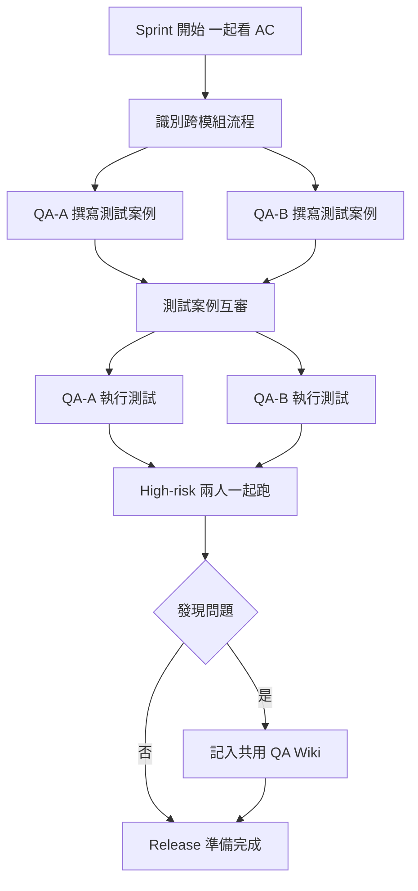

# 我們兩個 QA 各測各的，結果同一個 bug 都沒人發現

---

## 目錄

1. [各測各的問題](#各測各的問題)
2. [我們當時缺少的三件事](#缺少的三件事)
3. [我們現在怎麼協作](#現在怎麼協作)
4. [跟 RD 的協作：比你想像的更重要](#跟-rd-的協作)
5. [結尾](#結尾)

---

## 各測各的問題

團隊多了一個 QA 同事的時候，我們很快就分好了模組：我負責帳號和訂閱，他負責計時器和森林。

看起來很合理。覆蓋範圍不重疊，不會測重複的東西。

結果那次 release 之後，有一個 bug 從兩個模組的交界冒出來：用戶用 Google 帳號首次完成計時種樹，結果種植成功畫面出現了，但訂閱狀態的稀有樹種解鎖沒有同步到 主功能服務，樹木出現在森林裡，但顯示的是免費版的樹種，Pro 版限定的樹種沒有解鎖。

這個 bug 橫跨帳號、訂閱、計時器、森林四個模組。他不測訂閱，我不測森林，誰都沒有想到要測這個組合。

上線後用戶回報的。

---

## 缺少的三件事

那次之後我們回去想，各測各的哪裡出了問題。

**第一：沒有人負責跨模組流程**

我們把測試按模組切，但用戶的行為是跨模組的。種樹流程從帳號登入開始，到計時器，到種植完成，到森林狀態，到硬幣入帳。沒有一個人有完整的視角。

分工要切，但跨模組的 end-to-end 流程要有人顯式地負責，不能讓它掉進縫隙裡。

**第二：我們不知道彼此在測什麼**

他發現了一個商品排序的邏輯問題，沒有告訴我。我後來在金流測試裡用到那個排序，踩到同一個問題，又花了時間重新定位。

這不是他的問題，是我們沒有建立同步機制。

**第三：只有一個人了解某個模組的歷史**

他請假那週，有人問我商品模組某個邊界條件的測試覆蓋狀況，我完全不知道。

知識只在一個人腦子裡，是脆弱的。

---

## 現在怎麼協作

我們後來調整了幾個做法，不需要很複雜，但有效。

**做法一：每個 sprint 開始一起看 AC**

每次 sprint 開始，我們會花 30 分鐘一起看這個 sprint 的 Acceptance Criteria。

目的不是分工，是找「跨模組的流程在哪裡」。AC 上寫的是功能，但使用情境通常跨功能。這 30 分鐘讓我們在測試開始之前就知道哪些地方需要兩個人都注意，哪些地方要設計跨模組的測試案例。

**做法二：測試案例互審**

我寫完我的測試案例，他過一遍；他寫完的他的，我過一遍。

不是要找錯誤，是用另一個人的眼睛看有沒有明顯的漏洞。通常 10 分鐘就夠，但這 10 分鐘常常讓我想到他忘了的一個邊界值，或者他提醒我某個他知道但我不知道的歷史 bug。

這個做法讓我們的知識開始流動，不再只在各自腦子裡。

**做法三：high-risk 案例一起跑**

不是全部案例都要一起跑，但我們識別出幾個最高風險的流程，每次 release 前兩個人一起跑一遍。

一個人操作，一個人看著，隨時可以說「等等，這個結果對嗎」或「你試試看這個邊界」。

有點像 pair programming 的概念。兩個人看到的東西不一樣，一個人在操作時很容易對熟悉的畫面視而不見，旁邊的人反而更容易注意到異常。

**做法四：發現的問題記進共用 Wiki**

不管是誰發現的，只要是「這個模組有這個隱性規則」或「這個地方過去出過 bug」，就記進我們的共用 QA Wiki。

下次不管誰在測這個模組，都能看到這份歷史。這讓「某人請假就完蛋」的問題慢慢消失。

---

## 跟 RD 的協作：比你想像的更重要

QA 跟 QA 的協作是一件事，但跟 RD 的協作對測試品質的影響更大，而且常被低估。

**在 spec 討論階段就介入**

我以前習慣等 RD 說「功能做好了，可以測了」才開始。現在我在 spec 還在討論的時候就會進去看一眼，問幾個問題：

- 「這個情境下如果用戶做了 X，系統怎麼反應？」
- 「這個 API 的錯誤處理有沒有定義？」
- 「這個功能跟 Y 模組之間的邊界是什麼？」

這些問題早一點問，比等到測試時才發現規格沒定義清楚省很多來回。

有時候 RD 回答「喔這個我還沒想到」，那就是在測試之前就把一個潛在 bug 擋掉了。

**讓 RD 知道你在測什麼**

我會在 sprint 開始時跟 RD 說：「這次我的測試重點會放在 A 和 B，C 我可能只跑 happy path。」

這讓他知道如果 C 有風險，他可以主動告訴我。也讓他在開發 A 和 B 的時候知道 QA 會認真看那裡，自然會多注意一點。

**bug 要說清楚，不要說「壞了」**

當我把 bug 回報給 RD，我盡量說：「在這個前置條件下，做了這個操作，預期是 X，但實際是 Y。」

不是「你的功能壞了」——這樣說讓他需要重新理解問題，而且可能讓對話變成防衛性的。

具體描述讓 RD 能快速定位問題，也讓對話保持在「我們一起解決這個問題」的氛圍，而不是「你做壞了我來挑毛病」。

---

## 結尾

各測各的那段時間，表面上我們覆蓋了所有模組。但品質是假的——我們各自有盲點，而且沒有機制讓彼此的知識互通。

現在這幾個做法不是什麼大工程，加起來每個 sprint 多花不到兩小時。但這兩小時換來的是：bug 更少漏到上線、某人請假不會讓測試品質掉一截、跟 RD 的關係從「你做壞我來測」變成「我們一起確保品質」。

測試不是一個人的事，但要讓它真的變成大家的事，需要刻意設計工作方式，而不是等它自然發生。
