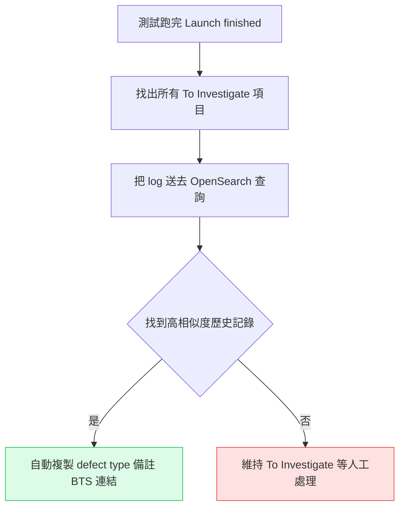
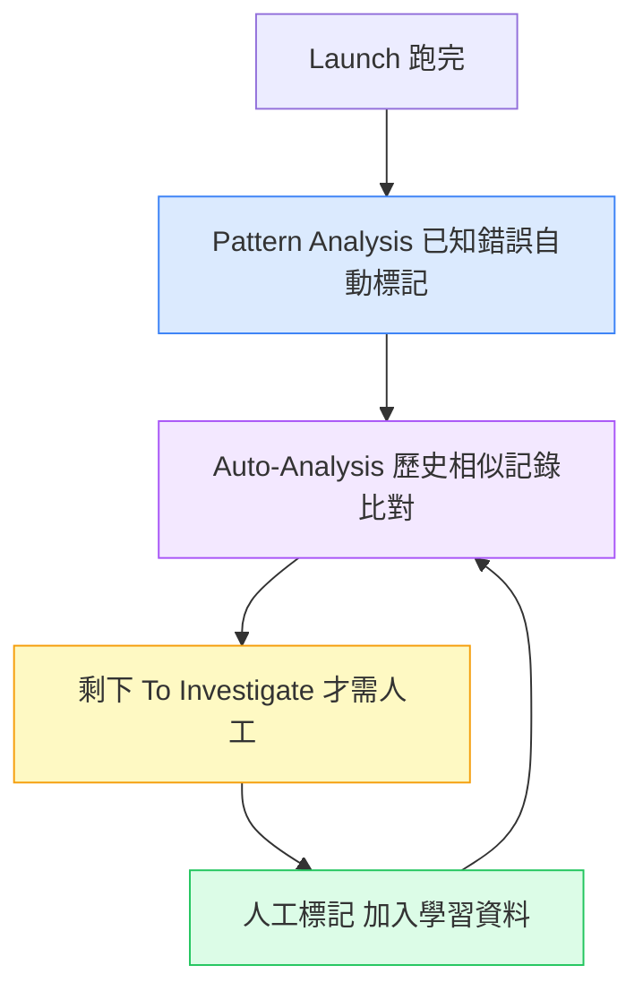

# ReportPortal AI 分析功能實戰：讓它真的幫你省時間

---

## 目錄

1. [為什麼大家開了 Auto-Analysis 卻沒什麼用](#為什麼沒用)
2. [Auto-Analysis 怎麼運作的](#怎麼運作)
3. [Pattern Analysis 和 Auto-Analysis 的差異](#差異)
4. [第一步：先訓練它，再開啟它](#先訓練)
5. [設定三個關鍵參數](#三個參數)
6. [v25.1 新增：Retry 分析選擇](#retry-分析)
7. [Immediate Analysis：不用等 Launch 跑完](#immediate)
8. [Pattern Analysis 實戰設定](#pattern-實戰)
9. [真正能省時間的工作流程](#工作流程)

---

## 為什麼大家開了 Auto-Analysis 卻沒什麼用

很多人第一次用 ReportPortal 的時候，會發現有一個「Auto-Analysis」的選項，開啟之後⋯⋯然後發現所有失敗的測試還是都標著「To Investigate」，什麼都沒有自動分析。

問題不是功能壞掉，是 **Auto-Analysis 需要先「餵資料」才能運作**。

它是機器學習，不是規則引擎。沒有學習資料，它不知道你的 `NullPointerException` 是 Automation Bug 還是 Product Bug、你的 `connection timeout` 是 System Issue 還是真的有問題。

這篇從頭說清楚怎麼讓它真的跑起來。

---

## Auto-Analysis 怎麼運作的

ReportPortal 的 Auto-Analysis 背後是 **OpenSearch + ML 模型**，流程大概是這樣的：



關鍵在「歷史記錄」——它比對的是你**過去人工標記過的失敗記錄**。

你有標記越多、越準確，它分析的命中率就越高。沒有歷史資料，它什麼都做不了。

---

## Pattern Analysis 和 Auto-Analysis 的差異

這兩個功能很容易搞混，但它們是互補的，不是同一件事：

| | Pattern Analysis | Auto-Analysis |
|---|---|---|
| 邏輯 | 規則比對（你定義的關鍵字）| ML 比對（相似歷史記錄） |
| 需要訓練？ | 不需要，你自己寫規則 | 需要，先人工標記 |
| 適合什麼 | 固定錯誤訊息（已知問題）| 變化的 log 內容（需要判斷的問題）|
| 執行順序 | **先跑** | Pattern 跑完才跑 |

**實際建議：兩個一起開。**

先讓 Pattern Analysis 處理你已知的固定錯誤（例如「服務 A 掛掉一定出現 connection refused」），剩下的交給 Auto-Analysis 根據歷史記錄判斷。

---

## 第一步：先訓練它，再開啟它

這是最多人搞反的步驟。

**不要先開 Auto-Analysis，要先跑幾次人工分析，再開 Auto-Analysis。**

正確流程：

**1. 第一次跑完測試，先人工分析**

對每一個失敗的測試項目，開啟 **Make Decision** 視窗，手動把它標記成對應的 defect type：

| Defect Type | 什麼時候用 |
|-------------|-----------|
| Product Bug | 功能本身有問題，app 行為不符預期 |
| Automation Bug | 測試腳本本身的問題（locator 壞掉、timing 問題）|
| System Issue | 環境問題（server 掛掉、網路連線失敗、emulator 異常）|
| No Defect | 測試結果是正確的（預期中的失敗）|
| To Investigate | 還不確定，留著之後看 |

每一筆你標記的記錄，都會進入 OpenSearch 的分析索引，成為之後 Auto-Analysis 的學習資料。

**2. 重複幾次，讓資料量夠**

一兩次跑的資料量太少，Auto-Analysis 的命中率會很低。建議至少人工標記 3–5 次 Launch 之後，再開啟自動分析。

**3. 開啟 Auto-Analysis**

Project Settings → Analyzer → 開啟 Auto-Analysis。

之後的 Launch 跑完，它就會自動比對歷史記錄，把能判斷的項目自動標記好，你只需要人工處理剩下「To Investigate」的部分。

---

## 設定三個關鍵參數

開啟 Auto-Analysis 之後，有三個設定值得調整：

**1. Minimum should match（相似度閾值）**

預設值是 **95%**，代表 log 內容要有 95% 相似，才會自動套用歷史記錄的 defect type。

這個值調太低（例如 70%）會讓它亂標——不夠相似的 log 也被強制套分類，準確率下降。建議維持 95%，確實信。

**2. All logs with 3+ rows should match**

勾選這個之後，只會比對 log 的前三行。

適合用在 log 很長但錯誤訊息都集中在開頭的情況——可以加快比對速度，減少資料庫負擔。如果你的 log 關鍵資訊在中間，不要勾。

**3. 指定用哪些 Launch 當分析基礎**

可以設定 Auto-Analysis 只參考特定名稱的 Launch（例如只參考 regression 而不參考 smoke）。

如果你有多個測試類型混在同一個 project，建議設定這個，避免不同類型的測試互相干擾分析結果。

---

## v25.1 新增：Retry 分析選擇

v25.1 加入了一個新的設定：**分析 failed test 時，要送「最新一次 retry 的 log」還是「最長的 retry 的 log」？**

**為什麼這件事重要：**

有些 flaky test 會 retry 多次，每次失敗的 log 可能不一樣（不同的 timing、不同的錯誤訊息）。

- **最新一次 retry**：反映最終失敗的狀態，比較接近真實問題
- **最長的 retry**：log 最完整，提供更多分析線索

預設是最新一次 retry。如果你的 flaky test 問題複雜，可以試試改成「最長的 retry」看分析準確率是否提升。

設定位置：Project Settings → Analyzer → **Defect assignment based on the longest retry**

---

## Immediate Analysis：不用等 Launch 跑完

預設情況下，Auto-Analysis 要等整個 Launch 跑完才開始分析。

如果你的測試 suite 很大（幾百個測試），可能要跑一兩個小時，等跑完再分析就太慢了。

**開啟 Immediate Analysis：**

Project Settings → Analyzer → 勾選 **Immediate Auto-Analysis**

開啟之後，每個測試項目失敗的當下就會立刻送去分析，不用等整個 Launch 完成。你可以在測試還在跑的時候，就開始看分析結果。

**Immediate Pattern Analysis 也有同樣的設定，建議一起開。**

---

## Pattern Analysis 實戰設定

Pattern Analysis 不需要訓練，只需要你定義「規則」。

規則的邏輯是：**如果 log 裡出現這個字串，就標記成某個 defect type，並加上備註。**

**設定方式：**

Project Settings → Pattern Analysis → Add Pattern

```
規則名稱：Connection Refused - System Issue
類型：STRING（優先用 STRING，比 REGEX 快）
規則內容：Connection refused

對應的動作：
- Defect Type → System Issue
- Comment → 環境連線問題，確認服務是否正常
```

**幾個常用的 Pattern 建議：**

| Pattern 名稱 | 觸發字串 | 對應分類 |
|-------------|---------|---------|
| 服務連線失敗 | `Connection refused` | System Issue |
| Element 找不到 | `NoSuchElementException` | Automation Bug |
| 逾時 | `TimeoutException` | System Issue |
| Assert 失敗 | `AssertionError` | Product Bug |
| NPE | `NullPointerException` | 看情況，先 Automation Bug |

`NullPointerException` 要注意——它可能是 app 的問題（Product Bug），也可能是測試腳本的問題（Automation Bug）。建議先設成 Automation Bug，看到 Product Bug 的 NPE 再人工改。

---

## 真正能省時間的工作流程

把上面全部串起來，理想的工作流程長這樣：



剛開始的時候，To Investigate 還很多，大部分要人工處理。但每次你標記，都是在餵資料給 Auto-Analysis。

大概跑了 10–20 次 Launch 之後，你會發現需要人工處理的比例越來越低——Auto-Analysis 已經認識你的測試環境了。

這才是它真正省時間的地方：不是一開始就全自動，而是**越用越準，越用越省**。

---

*參考資料：[Auto-Analysis of Launches - ReportPortal Docs](https://reportportal.io/docs/analysis/AutoAnalysisOfLaunches/) ／ [Pattern Analysis - ReportPortal Docs](https://reportportal.io/docs/analysis/PatternAnalysis/) ／ [Version 25.1 Release Notes](https://reportportal.io/docs/releases/Version25.1/)*
