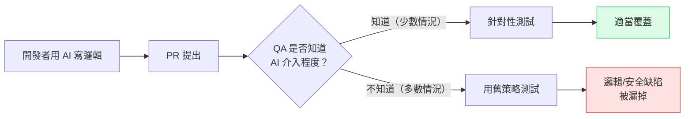

# AI 寫的 Code，QA 怎麼測？Copilot 時代的測試新挑戰

---

## 目錄

1. [你的開發者在用 AI 寫 Code，你知道嗎？](#你的開發者在用-ai-寫-code你知道嗎)
2. [AI 生成程式碼的缺陷，長什麼樣](#ai-生成程式碼的缺陷長什麼樣)
3. [三類 AI Code 特有的 Bug](#三類-ai-code-特有的-bug)
4. [QA 面對的新挑戰：你不知道哪些是 AI 寫的](#qa-面對的新挑戰你不知道哪些是-ai-寫的)
5. [測試策略怎麼調整](#測試策略怎麼調整)
6. [QA 在 AI 輔助開發時代的新角色](#qa-在-ai-輔助開發時代的新角色)

---

## 你的開發者在用 AI 寫 Code，你知道嗎？

2026 年某個週二凌晨 3:17，一段 Copilot 生成的程式碼在生產環境靜靜跑完——刪掉了 47,000 筆使用者資料。

這段程式碼被三位資深工程師 review 過，通過了 CI/CD，順利部署。沒有人抓到那個 bug。事後的緊急應變花了 14 小時，資料復原費用 47,000 美元。

作者在文章裡只寫了一句話：「nobody caught it.」

2026 年，GitHub Copilot 的企業訂閱用戶超過 150 萬。大量開發者每天用 AI 寫函式、補邏輯、生測試案例。你最近合作的開發者，有多少人在用 Copilot 或 Claude Code？答案可能是：**幾乎全部**。

他們提 PR 的時候，不會在 commit message 裡寫「這段是 AI 生的」。你看到的是一段正常的程式碼——你不知道它是花 30 秒讓 AI 產出的，還是開發者細想過的實作。

**AI 寫的 code，缺陷率比你想的高。**

---

## AI 生成程式碼的缺陷，長什麼樣

> **關鍵數據：** 根據 Parasoft 2026 年的研究，超過一半的 AI 生成程式碼樣本存在邏輯或安全缺陷，缺陷率顯著高於人工撰寫的程式碼。

這個數字讓很多人意外。AI 寫的程式碼可以順利編譯、通過語法檢查、跑過基本的 unit test——看起來沒問題，但裡面埋著洞。

**AI 在預測「最可能的下一個 token」，不是在理解業務邏輯。**

它看過大量的程式碼，知道「這類函式通常長這樣」。但它不知道：
- 你的系統有什麼業務規則
- 這段邏輯在哪些邊界情況下會失效
- 你的 API 版本是不是它訓練資料裡的版本

---

## 三類 AI Code 特有的 Bug

### 1. 邏輯正確，業務錯誤

AI 可以寫出邏輯上沒問題的程式碼，但這段程式碼對應的業務規則是錯的。

比如：一個折扣計算函式，AI 寫出了合理的數學邏輯，但少了「折扣不得使商品售價低於成本價」的業務約束。測試只驗證了計算結果是否符合公式，沒有驗證結果是否合理。

這類 bug 在 [AI 取代 QA 團隊的銀行案例](/blog/ai-replaced-qa-6m-loss)裡出現過——AI 生成的折扣邏輯把商品價格設為零，測試套件沒有認定這是錯的，因為沒有人告訴 AI「價格不能是零」。

### 2. 安全漏洞：模式正確，用法錯誤

AI 寫的安全相關程式碼特別危險，原因是它用的是「看起來正確的模式」，但在細節上出錯。

常見案例：
- SQL query 用了 parameterized query，但某一個參數仍然是字串拼接
- JWT 驗證邏輯的結構正確，但沒有驗證 `alg` 欄位，導致可以接受 `alg: none`
- 密碼 hash 用了 bcrypt，但 round 數設成 1（等於沒有 hash）

這些錯誤能通過「有沒有用安全 API」的 code review 檢查點，但在實際使用時是漏洞。

數據更直接：GitGuardian 2026 年報告指出，AI 輔助提交的 hardcoded secrets 洩漏率是 **3.2%**，是人工提交基準值（1.5%）的兩倍以上。2025 年全年，公開 GitHub repos 新增了 2,865 萬筆 hardcoded secrets，其中 AI service credentials（LLM API keys、embedding 服務金鑰）年增 81%。

Escape.tech 掃描 1,400 個生產環境應用後發現：65% 有安全問題，58% 含至少一個 critical vulnerability，400 件以上是直接暴露的 secrets。

### 3. 幻覺依賴：呼叫不存在的 API

AI 有時會引用在它訓練資料裡存在、但實際上已棄用或從未存在的 API 方法。

這類問題在靜態分析就會被抓。更隱蔽的變體是：**API 存在，但行為跟 AI 描述的不一樣**——版本差異、參數順序錯誤、回傳值格式不同。這些要到 integration test 或 E2E 才能抓到。

---

## QA 面對的新挑戰：你不知道哪些是 AI 寫的

傳統的 QA 風險評估，會考慮：「這段邏輯複雜嗎？這個功能影響範圍大嗎？這個開發者對這個模組熟不熟？」

現在多了一個變數：**這段程式碼是 AI 生成的嗎？**



問題有三層：

**第一層：不透明性**
開發者不一定主動揭露哪些部分用了 AI。即使有意願，也很難精確說明「AI 負責了哪些邏輯決策」。

**第二層：信任轉移**
「這段 code 是 AI 寫的」有時反而讓人更放心（「AI 比我仔細」），但研究數據顯示這個直覺是錯的。

**第三層：覆蓋率盲點**
AI 寫的程式碼在 happy path 上往往表現良好，但邊界情況、非預期輸入、業務規則例外——這些是 AI 最容易漏的，也是舊測試策略最容易跳過的。

---

## 測試策略怎麼調整

不需要大幅改造流程。以下四個調整方向，優先順序由高到低：

### 調整一：加重 Boundary Testing 和 Negative Testing

AI 在訓練資料裡看過的多是正常輸入的程式碼，對邊界的處理常常是「補上去的」，不是「設計進去的」。

測試計畫要明確列出：
- 數值邊界（最大值、最小值、零、負值）
- 空值和缺少欄位的情況
- 格式合法但語意異常的輸入（比如有效的日期，但是未來 100 年後）

這些在 AI 生成邏輯的情境下，bug 機率比平時更高。

### 調整二：對新增程式碼做安全 checklist

不需要做完整的滲透測試，但以下三類要點對要確認：

| 風險類型 | 要確認的事 |
|----------|------------|
| SQL / NoSQL Injection | 所有外部輸入是否都走 parameterized query 或 ORM |
| 認證與授權 | token 驗證邏輯有沒有 `alg` 白名單、expiry 確認 |
| 敏感資料處理 | log 裡有沒有不小心印出密碼、token、個人資料 |

### 調整三：業務邏輯要有明確的驗收條件

AI 最大的盲點是不懂業務規則，而業務規則最容易被「它看起來跑過了」帶過去。

對每個有業務邏輯的功能，在測試計畫裡要明確寫出：
- 這個功能「絕對不能發生」的情況（invariants）
- 超出正常範圍的結果應該怎麼處理（比如：折扣後價格不得低於成本）

### 調整四：在 Code Review 加入 AI 風險提問

跟開發者合作，把這幾個問題帶進 PR review：
1. 這段邏輯有沒有業務規則約束沒有反映在程式碼裡？
2. 邊界情況有沒有被處理？
3. 安全相關邏輯有沒有測試覆蓋？

不是要製造額外工作，是要確認這些問題有人負責回答。

---

## QA 在 AI 輔助開發時代的新角色

AI 寫程式碼這件事不會消失，只會更普遍。

這對 QA 的意義不是「AI 生成的 code 更難測，所以工作量增加」——而是 **QA 的判斷力變得更稀缺、更有價值**。

AI 可以快速生成大量程式碼，但它不知道：
- 你的系統有什麼業務規則不能違反
- 什麼邊界情況在你的用戶場景下特別危險
- 什麼安全風險在你的產業裡是大事

這些判斷，需要人。需要理解產品、理解用戶、理解風險的 QA 工程師。

就像測試 AI 系統的文章說的：不是 AI 不能測，是我們還在用舊思維去應對一個新的風險結構。

改的不是測試工具，是測試策略的重心。

---

## QA 測試 AI 生成程式碼 Checklist

```
□ 邊界值測試：數值最大/最小/零/負值都有覆蓋
□ 空值和缺少欄位的情況有測試
□ 業務規則的 invariants 有明確列出並測試
□ SQL / NoSQL query 有確認 parameterized
□ 認證邏輯有確認 alg 白名單和 expiry
□ Log 輸出有確認不含敏感資料
□ 新增 API 呼叫有確認版本和行為是否符合預期
□ PR review 有問「哪些業務規則約束沒在程式碼裡？」
```

---

*參考資料：*
- *[GitHub Copilot Wrote Code That Passed Review (And Wiped Our User Data) - Level Up Coding](https://levelup.gitconnected.com/github-copilot-wrote-code-that-passed-review-and-wiped-our-user-data-18affdec690e)*
- *[Vibe Coding Security Crisis: Credential Sprawl and SDLC Debt - Cloud Security Alliance](https://labs.cloudsecurityalliance.org/research/csa-research-note-ai-generated-code-security-vibe-coding-202/)*
- *[Security Weaknesses of Copilot-Generated Code in GitHub Projects - ACM / arXiv](https://arxiv.org/abs/2310.02059)*
- *[Top 5 AI Testing Trends for 2026 - Parasoft](https://www.parasoft.com/blog/annual-software-testing-trends/)*
- *[AI Testing in 2026: Why Signal, Trust, and Intentional Choices Matter - Applitools](https://applitools.com/blog/ai-testing-strategy-in-2026/)*
