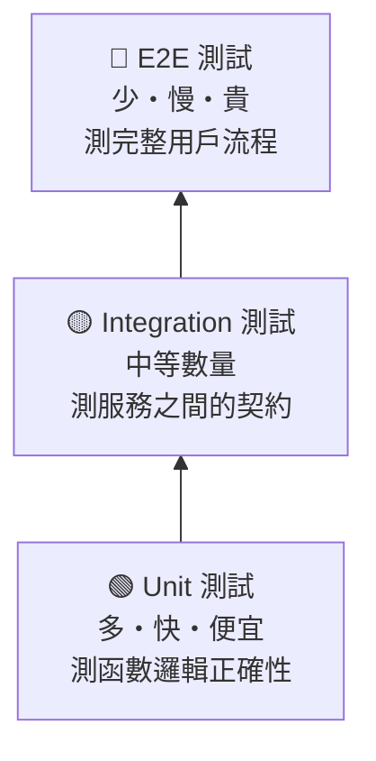

# 為什麼你的 unit test 覆蓋率 100% 但 QA 還是找到 bug

---

## 目錄

1. [那個「不可能有問題」的功能](#那個不可能有問題的功能)
2. [Unit test 測的是什麼，不是什麼](#unit-test-測什麼)
3. [QA 測的那些地方，unit test 天生覆蓋不到](#qa-測的地方)
4. [測試金字塔的真正意義](#測試金字塔)
5. [結尾](#結尾)

---

## 那個「不可能有問題」的功能

Forest Focus 的硬幣計算邏輯，是整個 app 裡 unit test 覆蓋最完整的模組之一。

reward-service 有一個 `calculate_coins` 函數，負責根據計時時長、樹種、帳號等級計算應得硬幣。這個函數有 30 幾個 unit test，覆蓋了正常計算、邊界值、特殊倍率活動、退款扣除——所有 RD 能想到的情境都有。

coverage report：98.7%。

那次 release 前，RD 跟我說：「硬幣計算這塊你可以不用太認真測，unit test 很完整。」

我還是測了。

測到第三個案例：用戶完成計時，計算結果正確，但硬幣沒有反映在森林主頁的顯示上。重整 app 之後才出現。

---

## Unit test 測什麼，不是什麼

Unit test 測的是一個函數，在隔離的環境下，給定輸入，輸出是否符合預期。

`calculate_coins(duration=25, tree="oak", level="free")` → 應該回傳 `25`

這個測試可以很完整。你可以測幾十種輸入組合，全部都過。

但 unit test 測不到的是：

**這個函數的輸出，有沒有被正確地傳到下一個環節。**

Forest Focus 的架構是：`timer-service` 計時結束 → 呼叫 `reward-service.calculate_coins()` → 把結果寫進 `forest-service` → `forest-service` 觸發前端更新。

`calculate_coins` 計算完全正確。問題出在 `reward-service` 把結果寫進 `forest-service` 的那一步：兩個 service 之間用的是 event queue，而那次 release 裡 `forest-service` 改了接收 event 的欄位格式，`reward-service` 傳的是舊格式。Event 進了 queue，但 `forest-service` 解析失敗，靜默丟掉了。

`calculate_coins` 的 unit test 全部綠。但整個流程壞了。

---

## QA 測的那些地方，unit test 天生覆蓋不到

**服務之間的整合**

Unit test 的核心假設是隔離：mock 掉所有外部依賴，只測這一個函數的邏輯。這讓 unit test 快速、穩定，但代價是：它沒有辦法發現兩個服務之間格式不對齊的問題。

只有整合測試或端到端測試才能抓到這類問題。QA 跑的 end-to-end 流程——「計時完成 → 查看森林 → 確認硬幣」——天然覆蓋了這個路徑。

**真實的環境條件**

Unit test 在乾淨的 test environment 跑。網路永遠通，資料庫永遠回應，外部服務永遠正常。

但 QA 測試的時候，偶爾會在網路不穩的條件下測，偶爾會在 staging 環境資料不乾淨的狀態下測。這些條件會暴露 unit test 永遠暴露不了的問題。

**用戶的操作順序**

Unit test 測的是函數，不是用戶流程。用戶在計時結束之前切換 App、在結算畫面快速點兩次領取、在弱網環境下拉長了 API timeout——這些操作 unit test 不會模擬，QA 會。

**跨版本的相容性**

用戶不會在你 release 的當天就更新 App。有些人用的是三個版本前的 client。Unit test 測的是當前版本的邏輯，不測舊 client 遇到新 server 的行為。

---

## 測試金字塔的真正意義

Unit test：多、快、便宜，測邏輯正確性。

Integration test：中等數量，測服務之間的契約。

E2E test：少、慢、貴，測完整的用戶流程。

這三層不是互相取代，是互相補充。100% 的 unit test 覆蓋率，代表你的函數邏輯測得很完整。但如果沒有 integration test，你不知道這些函數接在一起是否正確工作；如果沒有 E2E test，你不知道從用戶視角走一遍是什麼結果。

QA 主要活在 integration 和 E2E 這兩層。不是因為 unit test 不重要，是因為 unit test 不測的那些東西，需要有人去測。

---

## 結尾

那個硬幣沒有即時更新的 bug，修起來只改了兩行——`forest-service` event handler 加了一個格式轉換。

但如果沒有 QA 測那個完整的種樹流程，這個 bug 會上線。用戶種完樹，硬幣顯示沒更新，他以為自己沒種成功，又種了一次——但實際上第一次已經成功了，森林裡多了一棵樹，只是顯示延遲了。

Unit test 覆蓋率是一個指標，不是保證。它告訴你邏輯模組測得多完整，不告訴你系統整體行不行。

RD 覆蓋好 unit test，QA 覆蓋好整合路徑，才是完整的測試。
