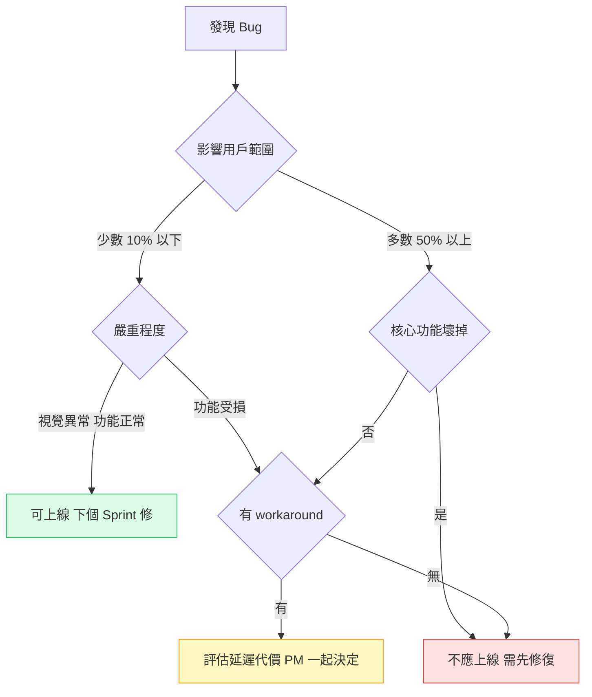

# 什麼時候可以說「夠好了，可以上線」

---

## 目錄

1. [那個我說不能上線但 PM 說可以的 bug](#那個爭議)
2. [「品質夠好」是誰決定的](#誰決定)
3. [我用來判斷的框架](#判斷框架)
4. [幾個常見的困難情境](#困難情境)
5. [結尾](#結尾)

---

## 那個我說不能上線但 PM 說可以的 bug

那次 release 前，我發現 我們的 App 的樹木詳情頁在某個特定的長按手勢下，畫面會閃爍一次，然後回到正常。功能完全正常，只是視覺上有一個短暫的閃爍。

我把它開成 High severity 的 bug，建議 delay release。

PM 看了之後說：「這個只有在特定手勢下才會出現，大部分用戶不會觸發，而且視覺上的問題不影響功能，我們按時上線，下個 sprint 修。」

我當時很不服氣。但後來想了很久，我發現我的判斷和 PM 的判斷哪裡不同：我在用「有沒有 bug」來判斷能不能上線，PM 在用「這個 bug 對用戶和業務的實際影響是多少」來判斷。

PM 的判斷框架更接近正確。

---

## 「品質夠好」是誰決定的

這是一個經常沒有說清楚的問題。

在很多團隊，「可以上線嗎」這個問題的答案是：
- QA 說「還有 bug，不行」
- PM 說「時程到了，上」
- 兩邊拉鋸

這個拉鋸的根本原因是：沒有一個雙方都認同的品質標準。

「零 bug 才能上線」是一個不可能達到的標準——任何複雜的系統都有未發現的 bug。但「有 bug 就能上線」也不是答案，因為有些 bug 的影響嚴重到不能接受。

品質標準需要在 sprint 開始之前就定好，不是在 release 前一天爭論。

---

## 我用來判斷的框架



每個開放中的 bug，我會問這四個問題：

**1. 影響的用戶範圍是多少？**

100% 的用戶都會遇到，還是只有在特定裝置、特定狀態下才會觸發？

閃爍 bug 需要特定的長按手勢，估計觸發率 < 1%。
硬幣入帳 bug 影響所有完成計時的用戶，觸發率 100%。

**2. 影響有多嚴重？**

功能完全壞掉、資料損毀、還是只是視覺異常？

閃爍：視覺異常，功能完全正常
硬幣未入帳：核心功能壞掉，用戶的努力沒有被記錄

**3. 有沒有 workaround？**

用戶有辦法繞過這個 bug 繼續使用嗎？

閃爍：有，不做那個手勢就好
硬幣未入帳：沒有，這是用戶做了正確操作但系統沒有正確回應

**4. 延遲上線的代價是什麼？**

如果為了這個 bug 延遲上線一週，失去了什麼？

這個問題很多 QA 沒有在想，但它是判斷不可缺少的一部分。如果這個 release 包含了一個用戶期待已久的功能、或者修復了一個更嚴重的 bug，那麼為了一個低影響的 bug 延遲上線，代價可能比 bug 本身更大。

---

## 用量化來對話

用上面的框架，每個 bug 有一個大概的評估：

```
閃爍 bug：
影響範圍：< 1% 用戶
嚴重程度：視覺異常，功能完全正常
Workaround：有
建議：可以上線，下個 sprint 修

硬幣入帳 bug：
影響範圍：100% 完成計時的用戶
嚴重程度：核心功能壞掉，用戶努力沒有被記錄
Workaround：無
建議：不應上線，需要修復
```

這個格式讓 PM 和 QA 用相同的資訊做決定，而不是各自用不同的框架爭論。

---

## 幾個常見的困難情境

**「這個 bug 只在舊版 iOS 才出現」**

你的用戶有多少比例還在用那個版本？

查 Firebase Analytics 的 OS version distribution。如果只有 2% 的用戶在 iOS 15 以下，為了這 2% delay release 的代價要和 bug 的嚴重程度比較。

**「不確定觸發頻率」**

有些 bug 你不知道多少用戶會觸發。

方法：先上線，在 Crashlytics 或 analytics event 加追蹤，24 小時後看觸發頻率，再決定是否需要緊急 hotfix。這是一種「接受已知風險，以觀測來驗證」的做法，比「猜測觸發頻率」更準確。

**「PM 說上，我說不行，誰說了算」**

最終決定權在 PM/業務方，不在 QA。

QA 的責任是提供清楚的風險資訊，讓 PM 做有根據的決定。如果 QA 提供了清楚的資訊（影響範圍、嚴重程度、workaround），PM 還是決定上線，那是 PM 的判斷和責任。

如果事後這個 bug 真的造成了問題，那次判斷的過程要做成 post-mortem，調整下次的標準，而不是追責。

---

## 結尾

「夠好了，可以上線」從來不是一個純技術的判斷，是技術和業務的綜合評估。

QA 的工作不是阻擋所有有 bug 的 release，是提供清楚的品質資訊，讓業務方能做出有根據的上線決定。有時候那個決定是「帶著已知 bug 上線」，這不是 QA 失職，是一個合理的業務選擇——只要是在清楚了解風險的情況下做的。

那個閃爍 bug，兩個月後在某次迭代中順手修掉了。從來沒有用戶回報過。PM 的判斷是對的。我從那次學到的是：「有 bug」和「這個 bug 不應該上線」是兩件不同的事。
