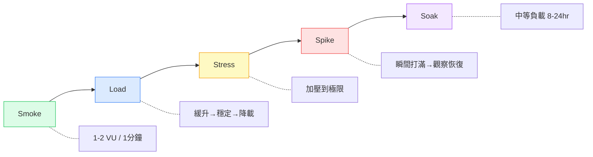
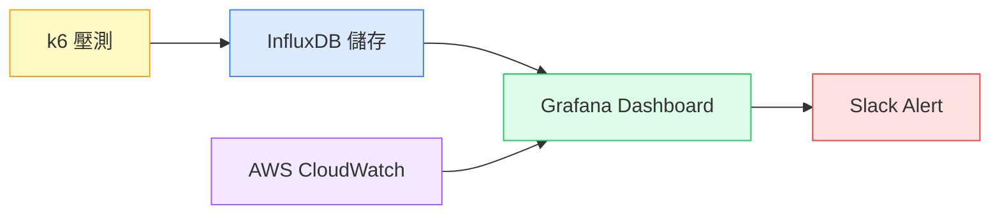

# 用 k6 打爆服務之後，我才學會怎麼做效能測試

> 改寫草稿｜原文：用 k6 打造真實場景的效能測試工具

---

## 目錄

1. [那次導航服務掛掉的事](#那次導航服務掛掉的事)
2. [效能測試不是只有一種](#效能測試不是只有一種)
3. [我實際跑的腳本長這樣](#我實際跑的腳本長這樣)
4. [怎麼知道服務是被你打掛的](#怎麼知道服務是被你打掛的)
5. [幾個踩過才懂的細節](#幾個踩過才懂的細節)

---

## 那次導航服務掛掉的事

主管說要做導航服務的壓測，我以為就是對 API 發一堆請求，看它撐不撐得住。

我直接把 VU（虛擬使用者）設到 1000，duration 1 分鐘，跑下去。

結果服務直接掛掉。所有請求 timeout，Redis 連線爆滿，後端工程師跑來重啟服務，整個 staging 環境停了將近 20 分鐘。

那是我第一次做效能測試。

後來我才知道，那叫做 Spike Test（尖峰測試）——瞬間打 1000 個使用者，是在測試服務抵抗突發流量的極限，不是一般壓測。我根本沒想清楚我在測什麼。

---

## 效能測試不是只有一種

那次之後我才去搞清楚，效能測試其實分很多種，每種目的不同：

| 類型 | 目的 | 流量特徵 |
|------|------|----------|
| Smoke Test | 確認腳本和環境沒問題 | 1–2 VU，跑 1 分鐘 |
| Load Test | 模擬正常使用量，建立基準線 | 緩慢爬升 → 穩定 → 降載 |
| Stress Test | 找極限，看服務怎麼死 | 慢慢加壓到掛 |
| Spike Test | 測試突發流量反應 | 瞬間打滿 → 觀察恢復 |
| Soak Test | 長時間穩定跑，找記憶體洩漏 | 中等負載跑 8–24 小時 |



我實際工作中常用的是 **Load Test** 和 **Stress Test**。Smoke Test 每次改完腳本我都會先跑一次確認沒有低級錯誤。Soak Test 我只跑過一次，但那次找到了一個 DB 連線池在長時間壓力下會慢慢耗盡的問題，很值得。

Spike Test 就是那個把服務打掛的。現在我知道要先溝通清楚，這種測試不能在沒準備的環境跑。

---

## 我實際跑的腳本長這樣

以下是導航壓測的完整腳本：

```javascript
import http from 'k6/http';
import { check, sleep } from 'k6';
import { SharedArray } from 'k6/data';
import papaparse from 'https://jslib.k6.io/papaparse/5.1.1/index.js';
import { htmlReport } from 'https://raw.githubusercontent.com/benc-uk/k6-reporter/main/dist/bundle.js';
import { config } from './config.js';

const csvData = new SharedArray('geoData', () =>
  papaparse.parse(open('./testData.csv'), { header: true }).data
);

const ENV = __ENV.ENV_NAME || 'test';
const { perfApiUrl } = config[ENV];

export const options = {
  noConnectionReuse: true,
  thresholds: {
    http_req_duration: ['p(95)<1000'],
  },
  stages: [
    { duration: '1m', target: 1000 },
    { duration: '30s', target: 0 },
  ],
};

export default function () {
  const from = csvData[Math.floor(Math.random() * csvData.length)];
  const to   = csvData[Math.floor(Math.random() * csvData.length)];

  const payload = JSON.stringify({
    address: [{
      from: { lat: parseFloat(from.lat_wgs84), lng: parseFloat(from.lon_wgs84) },
      to:   { lat: parseFloat(to.lat_wgs84),   lng: parseFloat(to.lon_wgs84)   },
    }],
  });

  const res = http.post(perfApiUrl, payload, {
    headers: {
      'Content-Type': 'application/json',
      appId:    __ENV.APP_ID,
      apptoken: __ENV.APP_TOKEN,
    },
  });

  check(res, { 'status 201': (r) => r.status === 201 });
  sleep(Math.random() * 1.5);
}

export function handleSummary(data) {
  return { 'summary.html': htmlReport(data) };
}
```

幾個我覺得值得說的設計決策：

**CSV 真實座標，不是假資料**

一開始我用固定座標測試，結果服務的 cache hit rate 高到不正常，P95 看起來超漂亮，但根本不是真實情況。換成從 CSV 隨機抽座標之後，數字難看多了，但那才是對的。

**`noConnectionReuse: true`**

關掉 HTTP Keep-Alive。行動端 app 的請求通常是短連線，不是長連線。如果不關，壓測數字會比真實情況好很多，沒有意義。

**`sleep(Math.random() * 1.5)`**

隨機等待 0 到 1.5 秒。人不會每個動作之間間隔一模一樣，這讓請求模式更接近真實使用者行為。

**Threshold 設 P95 < 1000ms**

這是跟後端工程師一起討論後定的目標，不是我自己隨便設的。P95 的意義是：1000 個請求裡，有 950 個要在 1 秒內回應。

---

## 怎麼知道服務是被你打掛的

跑完腳本只能告訴你 client 端看到的數字——請求延遲、失敗率。但如果你想知道**為什麼**慢或掛，你需要看 server 端。

我們的監控架構長這樣：



在那次服務掛掉的壓測裡，Grafana 上可以看到兩件事同時發生：
- k6 的 RPS 曲線在爬升到約 600 VU 時突然掉下去（請求開始 timeout）
- AWS CloudWatch 上 Redis 的連線數同一個時間點衝到上限

兩張圖放在同一個 dashboard，定位問題快很多。如果只看 k6 的數字，你只知道「壞了」，但不知道是哪裡壞。

Grafana 還可以設 Alert。我現在的做法是：壓測跑到 threshold 被觸發（也就是 P95 超過 1000ms）的時候，自動發 Slack 通知，不用一直盯著畫面。

---

## 幾個踩過才懂的細節

**先跑 Smoke Test，再跑正式壓測**

每次改腳本我都會先用 1 個 VU 跑 1 分鐘。不是測效能，是確認腳本本身沒有 bug、環境設定沒問題。省了很多「壓測跑到一半才發現 API endpoint 打錯」的時間。

**不要在 production 跑 Stress Test 或 Spike Test**

這是真的。我是在 staging 把服務打掛的，還好。

**SLA 是談出來的，不是算出來的**

Threshold 要跟 PM 和後端工程師一起決定，不是 QA 自己定。P95 < 1000ms 是大家接受的目標，才有意義。你自己設一個沒人 agree 的數字，壓測結果也沒辦法推動任何事。

**數字好看不代表沒問題**

那次用假座標測試就是例子。壓測結果要能代表真實使用情境，資料的品質跟腳本本身一樣重要。

---

這篇記錄的是我第一次做效能測試踩坑、重來的過程。k6 本身不難，難的是搞清楚你在測什麼，以及怎麼讓數字對團隊有意義。

如果你也是第一次接到「幫這個服務做壓測」的任務，希望這篇能讓你少踩幾個坑。
