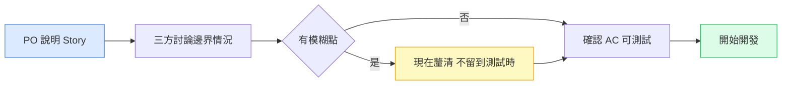
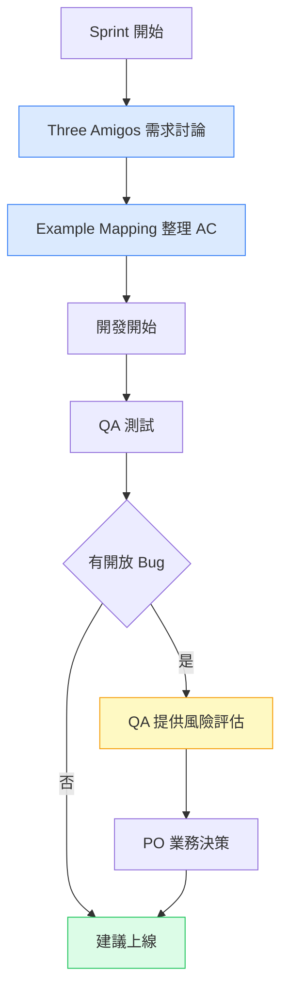

# PO 和 QA 其實是同一個問題的兩面

有一種對話我在很多團隊見過，而且幾乎每間公司劇本都一樣：

Sprint review 結束後，PM 問 QA：「這個功能你測完了嗎？」

QA 說：「測完了，但有兩個邊界情況我不確定是不是 bug——需求裡沒寫清楚。」

PM 沉默一秒，說：「那就先上，我來決定。」

兩週後，用戶回報其中一個邊界情況出了問題。Post-mortem 裡，大家都說「需求要寫清楚一點」，然後下個 sprint 一切如常。

這個循環，我見過不只一次。而且它幾乎每次都以同樣的方式結束：表面上是「需求寫得不夠清楚」，但實際上是 **QA 進入需求的時間點太晚了**。DORA 2024 年的研究指出，在需求階段就引入品質討論（shift-left）的團隊，其生產環境變更失敗率顯著低於在開發完成後才進行測試的團隊。

---

## 目錄

1. [PO 和 QA 的目標其實一樣](#目標一樣)
2. [問題從需求就開始了](#問題從需求)
3. [什麼叫「可測試的驗收標準」](#可測試的驗收標準)
4. [Three Amigos：把 QA 拉進需求討論的框架](#three-amigos)
5. [Example Mapping：讓討論有結構](#example-mapping)
6. [上線的決策：誰說了算](#上線決策)
7. [從爭論到協作：一個更有用的框架](#協作框架)

---

## 目標一樣

在大多數的 Agile 討論裡，Product Owner 和 QA 工程師被放在不同的角色框架裡：

PO 負責 **要做什麼**（what），QA 負責 **做好了沒**（whether）。

但這個分法有一個隱藏的問題：它讓兩個人用不同的語言討論同一件事。

PO 說：「用戶能成功完成購買流程」。  
QA 聽到的是：「測試購買流程的所有可能路徑」。  
開發聽到的是：「把購買功能做出來」。

三個人各自理解了需求，但沒有人確認過這三個理解是不是同一件事。

[CertivaQA 的 PO-QA 協作研究](https://www.certivaqa.com/qa-tips-and-insights/qa-po-collaboration)指出：PO 和 QA 表面上看起來立場對立（一個要快，一個要穩），但他們共同的目標其實一樣——**讓用戶得到一個可用的產品**。衝突來自溝通方式，不來自目標本身。

---

## 問題從需求就開始了

QA 最常碰到的挫折，不是在測試的時候發現 bug，而是**在測試的時候發現需求本身就沒說清楚**。

一張 user story 寫著：「用戶可以取消訂單」。

但沒有說：
- 已出貨的訂單可以取消嗎？
- 取消後退款流程是什麼？
- 部分取消（只取消其中一件商品）支援嗎？
- 取消後用戶收到通知嗎？

QA 寫測試案例的時候，這些問題全都要決定。如果沒有人回答，QA 就只能猜——然後在 review 的時候被說「你為什麼測這個？」或者上線後被用戶問「為什麼這樣？」

[Ministry of Testing 上關於 AC 品質的討論](https://club.ministryoftesting.com/t/story-acceptance-criteria-between-product-owner-and-quality-engineer/47974)有一句話我覺得很準確：「QA 看到的 bug，有一半其實是需求裡沒有定義到的行為。」

不是程式有問題，是「這個情況下應該發生什麼」從來沒人決定過。

---

## 什麼叫「可測試的驗收標準」

Acceptance Criteria（驗收標準，AC）是 PO 和 QA 之間最重要的溝通工具。

但不是所有的 AC 都是可以測試的。

**不可測試的 AC：**
- 「購買流程應該快」
- 「用戶體驗要好」
- 「錯誤訊息要清楚」

**可測試的 AC：**
- 「結帳頁面從點擊到完成結帳在 3G 網路下應在 5 秒內完成」
- 「用戶在購物車頁面可以修改商品數量，最小值為 1，最大值為商品庫存量」
- 「網路錯誤時，頁面顯示『連線失敗，請重試』，並提供重試按鈕」

差別在哪？可測試的 AC 有一個明確的 **pass/fail 條件**——你可以說「這個通過了」或「這個沒通過」，不需要主觀判斷。

[TechTarget 的研究](https://www.techtarget.com/searchsoftwarequality/tip/Who-writes-acceptance-criteria)指出，AC 的可測試性直接影響測試的品質：當 AC 描述清楚，測試案例更容易設計，測試結果更容易解讀，上線決策也更有依據。

QA 可以在需求討論階段就問 PO：「這個 AC 的 pass/fail 條件是什麼？」  
這不是在刁難，是在幫 PO 把模糊的需求變成可以驗證的規格。

---

## Three Amigos：把 QA 拉進需求討論的框架

**Three Amigos** 是 BDD 社群發展出來的一個協作框架，核心想法是：每張 story 在開始開發之前，要由三個角色一起討論——

- **Product Owner**（代表業務，知道「為什麼做」）
- **開發工程師**（代表實作，知道「能怎麼做」）
- **QA 工程師**（代表品質，知道「怎麼驗證」）

[Automation Panda 的 Three Amigos 解析](https://automationpanda.com/2017/02/20/the-behavior-driven-three-amigos/)描述了這個框架的核心價值：**三個角色在開發前就把對需求的理解對齊，避免各自假設。**

Three Amigos 會議通常很短（30 分鐘以內），但它改變的是 QA 出現在討論裡的時間點——從「開發完成後」變成「開發開始前」。

在這個會議裡，QA 問的問題不是「你有沒有做好」，而是「我們怎麼確認做好了」。  
這個問題在需求階段問，比在測試階段問，便宜得多。

---

## Example Mapping：讓討論有結構

Three Amigos 的對話如果沒有結構，很容易發散。**Example Mapping** 是一個讓討論有框架的工具，由 Matt Wynne 在 Cucumber 社群提出。

做法是用四種顏色的卡片，在白板或便利貼上整理討論的結果：

| 顏色 | 代表 | 例子 |
|------|------|------|
| 黃色 | User Story | 用戶可以取消訂單 |
| 藍色 | 規則（Rule） | 已出貨訂單不能取消 |
| 綠色 | 例子（Example） | 「用戶在已出貨訂單點取消，看到提示說無法取消」 |
| 紅色 | 問題（Question） | 「部分取消的訂單怎麼算？」 |

[Xebia 的 Example Mapping 介紹](https://xebia.com/blog/example-mapping-steering-the-conversation/)說明了為什麼這個工具有效：**它把「討論」轉變成「整理」。** 你不只是在聊需求，你在把需求的邊界條件一條一條列出來。

會議結束的時候，卡片上紅色的問題是還沒有答案的——這些是需要 PO 進一步定義的地方。如果一張 story 的紅色卡片太多，代表這張 story 還沒有準備好進入開發，需要先釐清。

這個方法讓 QA 的角色從「找問題的人」變成「把問題提早浮出水面的人」。

---

## 上線決策：誰說了算

Three Amigos 解決了需求階段的協作問題，但還有另一個常見的衝突點——**上線的時候。**

一個功能測完，QA 發現還有三個開放的 bug。PO 說：「時程到了，我們先上。」  
QA 說：「這個 bug 影響核心流程，不能上。」

這個對話在很多團隊每個 sprint 都發生。

[Big Agile 的研究](https://big-agile.com/blog/quality-control-challenges-with-product-management)指出，這個衝突的根本原因是：**PO 和 QA 用不同的語言描述相同的風險。** PO 在問「這個 bug 對業務的影響是多少」，QA 在問「這個 bug 有沒有修好」。這兩個問題的答案不一定一致。

根據 [u-tor.com 的 Scrum 品質所有權研究](https://u-tor.com/topic/who-owns-quality-in-a-scrum-team-explained)，在 Scrum 框架裡，產品品質的最終責任在整個 Scrum Team，而不在任何單一角色。PO 擁有最終的上線決策權，但這個決策應該基於清楚的風險資訊——這個資訊由 QA 提供。

所以 QA 的責任不是說「這個不能上」，而是說：

**「這個 bug 影響的用戶範圍是 X%，嚴重程度是 Y，有沒有 workaround 是 Z。上線的決定是你的。」**

把品質風險翻譯成業務語言，讓 PO 能做有根據的決定——這才是 QA 在上線決策裡真正的角色。

---

## 從爭論到協作：一個更有用的框架

整合上面的討論，PO 和 QA 的協作可以分成三個時間點：

**需求階段（sprint 開始前）**
- Three Amigos 會議：三方一起討論 story 的邊界條件
- Example Mapping：把規則和例子整理成可以驗證的格式
- QA 負責問「怎麼確認做好了」，不是等到測試時才問

**開發階段（sprint 進行中）**
- QA 在 AC 寫好後確認每一條都有 pass/fail 條件
- 開發者在實作時可以直接參考 examples 寫測試
- 邊界情況的問題在開發時就解決，不留到 QA 階段

**上線決策（sprint 結束前）**
- QA 提供風險資訊：影響範圍、嚴重程度、workaround 存在與否
- PO 根據風險資訊做業務決策
- 兩者共同承擔結果，不是事後追責

這個框架最重要的改變不是流程，是 **QA 出現的時間點**。QA 在需求階段就參與，帶來的不是更多會議，而是更少的「這個是 bug 還是 spec 問題」的爭論。

---

我在某次 sprint planning 嘗試過一個很小的改變：在 PO 說完 story 之後，我問了一個問題：「你覺得這個功能在什麼情況下算是做好了？」

PO 停頓了一下，然後把他腦子裡其實已經有的幾個驗收條件說了出來。

那次 sprint 的測試，比以往少了很多「這個行為是預期的嗎」的來回確認。

不是因為我問了什麼魔法問題，而是因為那個問題讓雙方在需求討論的時候就把期望對齊了——而不是等到測試時才發現期望不同。

PO 和 QA 是同一個問題的兩面。問題不在誰說了算，在我們有沒有在對的時間說清楚。

---

## 參考資料

- [QA Engineers vs Product Owners: How to Collaborate for Seamless Agile — CertivaQA](https://www.certivaqa.com/qa-tips-and-insights/qa-po-collaboration)
- [The Behavior-Driven Three Amigos — Automation Panda](https://automationpanda.com/2017/02/20/the-behavior-driven-three-amigos/)
- [Example Mapping — Steering the Conversation — Xebia](https://xebia.com/blog/example-mapping-steering-the-conversation/)
- [Story Acceptance Criteria between Product Owner and Quality Engineer — Ministry of Testing](https://club.ministryoftesting.com/t/story-acceptance-criteria-between-product-owner-and-quality-engineer/47974)
- [Who Writes Acceptance Criteria — TechTarget](https://www.techtarget.com/searchsoftwarequality/tip/Who-writes-acceptance-criteria)
- [DORA 2024 State of DevOps Report — dora.dev](https://dora.dev/research/2024/dora-report/)
