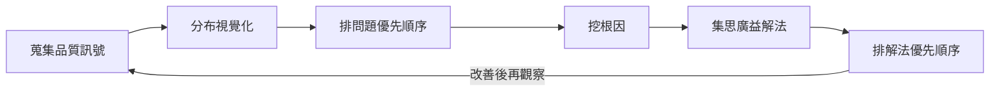
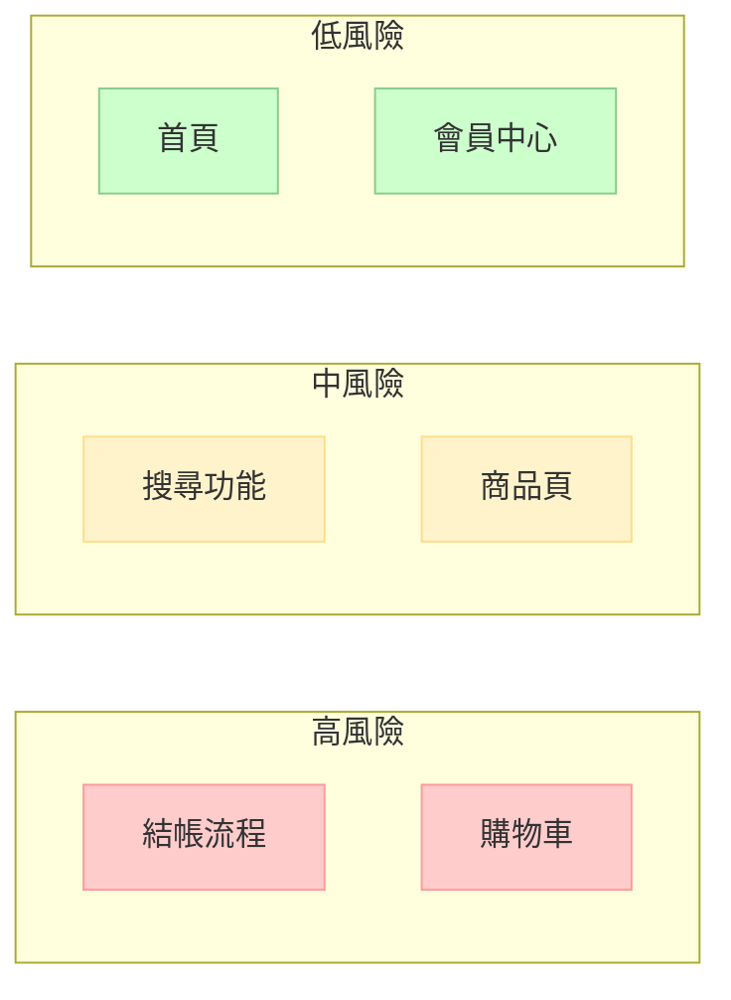
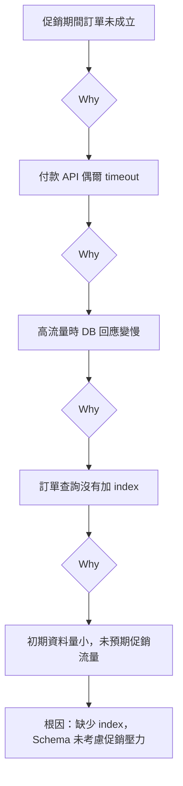

# 同一個地方一直出 bug？QA 的六步問題分析法

你有沒有遇過這種情況：

同一個功能，修了又壞，壞了又修。每個 sprint 都有人說「這個上次已經修過了」，然後 QA 又重新開一張 bug ticket。

問題不是沒人在修 bug。問題是**沒有人真正分析為什麼這個地方一直出問題**。

這篇文章想聊的是：當你發現某個功能區域像漏水的管子，問題一個補起來另一個又冒出來時，QA 能做什麼。

我把問題分析拆成六個步驟，每一步都有 QA 最常碰到的陷阱。

---

## 六步驟概覽

這不是一條直線，是一個循環。改善之後，回頭繼續觀察，看問題有沒有真的被解決。

---

## 步驟一：蒐集品質訊號（不只是看 bug 數量）

問題：QA 最容易只看自己的 bug tracker，忽略其他資訊來源。

品質訊號有很多種：

| 來源 | 訊號類型 |
|------|---------|
| 自動化測試失敗紀錄 | 哪些 case 反覆失敗？哪些是 flaky？ |
| Crash / 錯誤監控（Sentry、Firebase） | 線上真實發生的錯誤頻率和堆疊 |
| 客服票單 | 用戶實際回報的症狀（不是 QA 描述的 bug） |
| App 商店評論 | 使用者在不滿意時會說什麼 |
| Code review 紀錄 | 哪些模組改動最頻繁？改動的理由是什麼？ |
| Staging 環境的部署失敗紀錄 | 哪些功能在部署時最容易出問題？ |

**陷阱：把「我回報了幾個 bug」當作品質訊號。**

Bug 數量本身沒有太多意義。QA 回報 50 個 bug，可能是系統很爛，也可能是 QA 很認真探索了很多邊界。

真正有價值的訊號是**哪個地方一直出問題**，以及**真實用戶有沒有感受到**。

---

## 步驟二：把問題分布視覺化（看清楚漏水在哪裡）

把所有品質訊號攤開，標記到系統的功能地圖上。

不需要複雜工具，一張白板 + 功能模組清單就夠。

以一個電商 app 為例，把過去兩個 sprint 的 bug 標記上去：

這張圖讓你從「到底哪裡最需要注意」有了視覺上的答案——不是每個模組平均分配注意力，而是知道**漏水最嚴重的管子在哪裡**。

做這個的過程本身也很有價值：你可能會發現「結帳流程的 bug 有 60% 是在促銷期間發生的」這種模式，光靠看 bug 列表看不到。

---

## 步驟三：排問題優先順序（先定好準則，再排順序）

問題出現了——現在要決定先追哪一個。

**陷阱：每個人對「嚴重」的定義不一樣。**

PM 覺得影響轉換率的 bug 最嚴重，開發覺得崩潰最嚴重，客服覺得用戶一直打進來詢問的問題最嚴重。

解法是在開始排序之前，先對齊評估準則：

| 準則 | 說明 |
|------|------|
| 影響範圍 | 有多少用戶碰到？ |
| 發生頻率 | 每天幾次？ |
| 商業影響 | 會不會導致營收損失或用戶流失？ |
| 修復難度 | 需要多少開發資源？ |

讓每個人對每個問題打分，取平均或投票，而不是讓最會說話的人決定優先順序。

這個步驟做完，你會有一個明確的「這次要先解決什麼」，不是一個什麼都重要的清單。

---

## 步驟四：往下挖找出根因（修症狀沒有用）

這是最容易被跳過的一步。

問題出現 → 開 ticket → 開發修 → 關票。

但如果你只是修了這一次的症狀，下次同樣的根因出現，就會冒出另一個相似的 bug。

**5 Why 應用在 QA 場景的樣子：**

以「結帳流程在促銷期間有時候訂單沒有成立」為例：

如果只修「API timeout 的 retry 邏輯」，問題下次促銷還會回來。真正的根因是 schema 設計問題，要加 index，甚至要做壓力測試驗證。

**QA 在這一步的角色：**

QA 不一定是做根因分析的人，但 QA 可以是**提出「我們應該往下挖」的人**，以及**確認根因分析的結論是否和觀察到的現象吻合**。

如果開發說「根因是 A」，但你的測試紀錄顯示 B 情境也會觸發同樣的問題，這個矛盾需要在關票前解決。

---

## 步驟五：跨角色一起想解法（解法不只是修 code）

找到根因之後，很容易直接跳到「讓開發修」。

但解法有很多種，不一定只有改 code：

- **測試策略改變**：加壓力測試到 pipeline，確保促銷場景在上線前被驗到
- **監控補充**：在訂單 API 加 response time 告警，問題發生時立刻知道
- **流程改變**：促銷功能上線前 72 小時凍結其他結帳相關修改
- **架構調整**：讀寫分離，讓查詢不影響寫入效能
- **文件補充**：把「促銷場景注意事項」加入開發 checklist

這一步建議讓 QA、開發、PM 一起參與。每個角色看到的解法空間不同，QA 特別容易看到「加這個測試能不能提早發現」的角度。

**陷阱：只收集「能改的」解法，忽略了「不改也能降低影響」的解法。**

加監控不能防止 bug 發生，但能讓你在 5 分鐘內發現問題，而不是等用戶打客服電話。有時候這個價值不比修 bug 小。

---

## 步驟六：排解法優先順序（三個維度幫你選）

解法通常比問題多，但資源是有限的。

三個評估維度：

| 維度 | 問題 |
|------|------|
| 影響力 | 這個解法能減少多少問題發生？ |
| 可行性 | 多快能做完？需要什麼資源？ |
| 風險 | 做這件事本身會不會引入新問題？ |

讓每個人貼票投票——可以設三種票：「最快能做的」、「影響最大的」、「最想做的」。

最後決定先做哪個，要讓 sponsor（通常是 PM 或 tech lead）在場，確認優先順序符合業務方向。

**落選的解法不要丟掉。** 下次同類問題出現時，備選清單是很有價值的起點。

---

## 做這件事最難的地方

六個步驟說起來很順，但在實際工作中最難的地方是：

**沒有人覺得這是 QA 的事。**

「分析根因是開發的事。」
「排優先順序是 PM 的事。」
「想解法是架構師的事。」

QA 在這個框架裡的定位，不是接管別人的工作，而是**提供一個讓這些事情發生的結構**。

誰來整理品質訊號？誰來說「我們應該找一次讓大家對齊」？誰來確認根因分析和觀察到的現象吻合？

如果 QA 不做，通常沒有人做。

反覆出現的 bug 不是開發不努力的問題，通常是「從來沒有停下來問為什麼」的問題。這個停下來的動作，QA 最有動機，也最有視角去推動。
