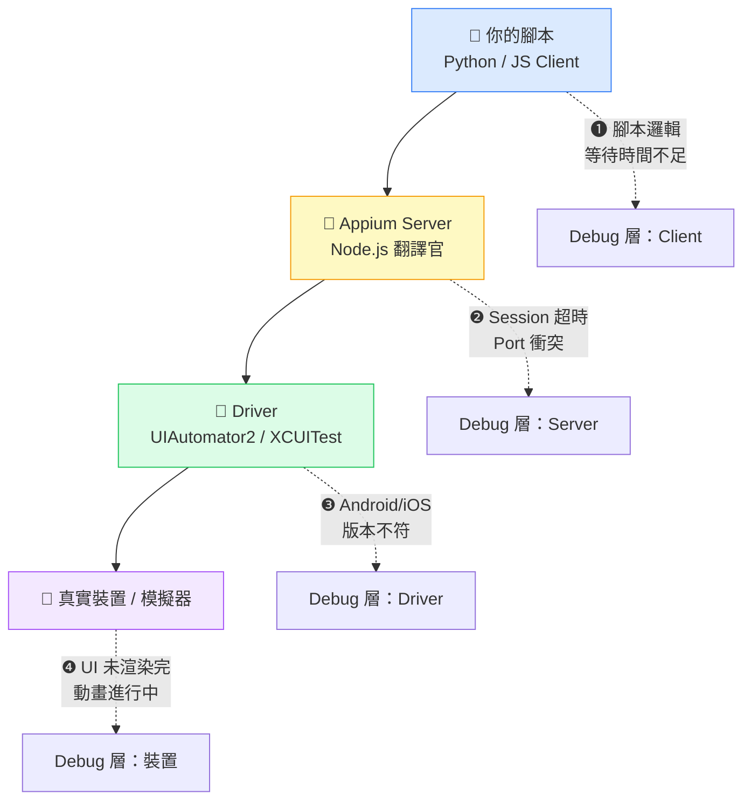
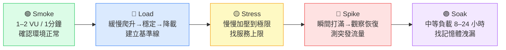
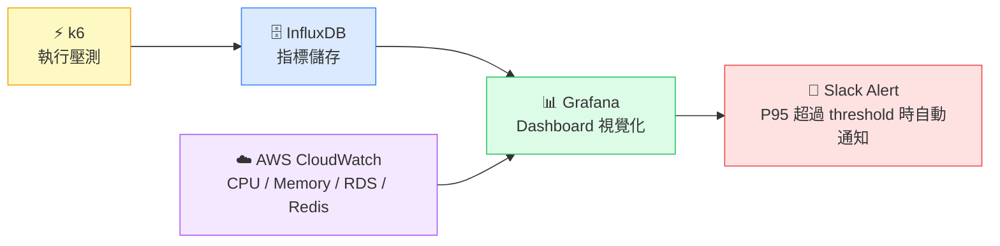
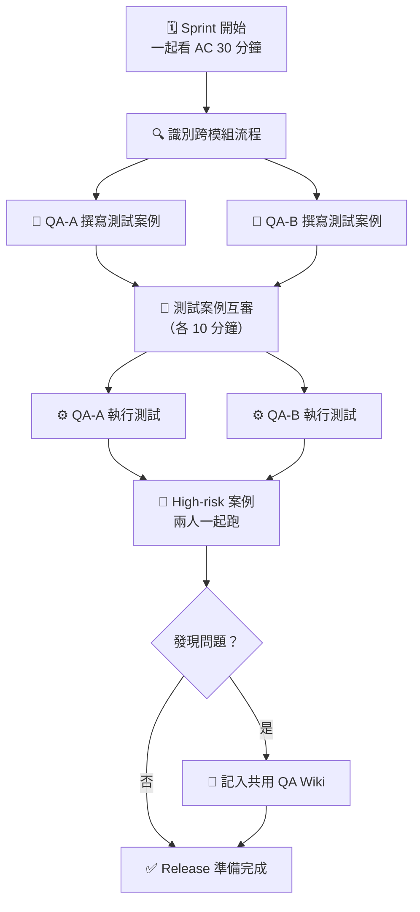
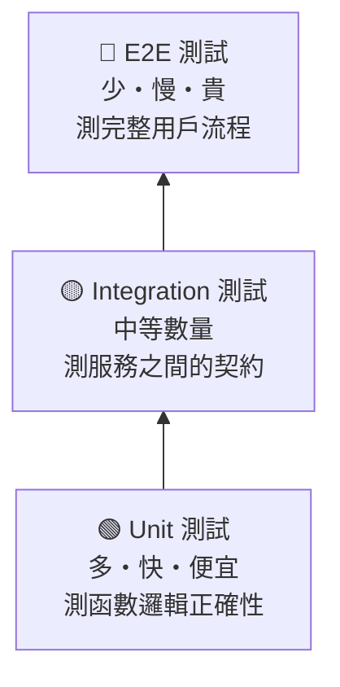
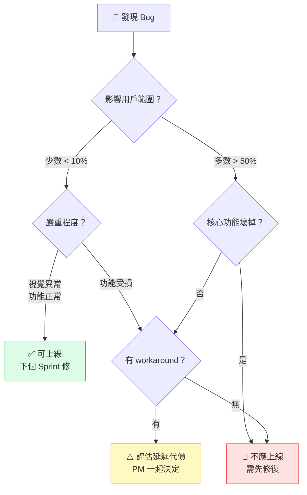

# Mermaid Diagrams Implementation Plan

> **For agentic workers:** REQUIRED SUB-SKILL: Use superpowers:subagent-driven-development (recommended) or superpowers:executing-plans to implement this plan task-by-task. Steps use checkbox (`- [ ]`) syntax for tracking.

**Goal:** Add Mermaid.js diagram support to the blog renderer and TipTap editor, then embed specific diagrams into five existing articles.

**Architecture:** A shared `MermaidChart` component renders mermaid definitions to SVG. `MarkdownContent` routes mermaid code blocks to `MermaidChart` on both the react-markdown and HTML rendering paths. TipTap gets a custom `MermaidBlockExtension` node that stores the mermaid definition as a node attribute and shows a live preview via a React NodeView; the block serializes to `<pre><code class="language-mermaid">...</code></pre>` so both paths read the same HTML format.

**Tech Stack:** `mermaid` npm package, `@tiptap/react` ReactNodeViewRenderer (already installed), vitest + @testing-library/react for tests.

---

## File Map

| Action | File | Responsibility |
|--------|------|----------------|
| Install | `package.json` | Add `mermaid` dependency |
| Create | `src/components/MermaidChart.jsx` | Render mermaid string → SVG inline |
| Create | `src/components/__tests__/MermaidChart.test.jsx` | Smoke + error tests |
| Modify | `src/components/MarkdownContent.jsx` | react-markdown custom code renderer + HTML path useEffect |
| Modify | `src/components/__tests__/MarkdownContent.test.jsx` | Add mermaid rendering tests |
| Create | `src/components/MermaidBlockExtension.jsx` | TipTap Node + ReactNodeViewRenderer |
| Create | `src/components/__tests__/MermaidBlockExtension.test.jsx` | Smoke test for NodeView |
| Modify | `src/components/RichTextToolbar.jsx` | Add ⬡ 圖表 button |
| Modify | `src/components/__tests__/RichTextToolbar.test.jsx` | Test new toolbar button |
| Modify | `src/components/RichTextEditor.jsx` | Register MermaidBlockExtension |
| Modify | `docs/appium-article-revised.md` | Add Appium architecture diagram |
| Modify | `docs/k6-article-revised.md` | Add test types timeline + monitoring flowchart |
| Modify | `docs/drafts/qa-team-collaboration.md` | Add collaboration workflow diagram |
| Modify | `docs/drafts/unit-test-100-but-qa-finds-bugs.md` | Add testing pyramid diagram |
| Modify | `docs/drafts/when-to-ship.md` | Add bug severity decision tree |

---

## Task 1: Install mermaid

**Files:** `package.json`

- [ ] **Step 1: Install mermaid**

```bash
npm install mermaid
```

- [ ] **Step 2: Verify install**

```bash
npm run build 2>&1 | tail -3
```

Expected: build completes without errors.

- [ ] **Step 3: Commit**

```bash
git add package.json package-lock.json
git commit -m "chore: install mermaid"
```

---

## Task 2: MermaidChart Component

**Files:**
- Create: `src/components/MermaidChart.jsx`
- Create: `src/components/__tests__/MermaidChart.test.jsx`

- [ ] **Step 1: Write failing tests**

Create `src/components/__tests__/MermaidChart.test.jsx`:

```jsx
import { render, screen, waitFor } from '@testing-library/react'
import { describe, it, expect, vi, beforeEach } from 'vitest'

vi.mock('mermaid', () => ({
  default: {
    initialize: vi.fn(),
    render: vi.fn(),
  }
}))

import mermaid from 'mermaid'
import MermaidChart from '../MermaidChart'

describe('MermaidChart', () => {
  beforeEach(() => {
    mermaid.render.mockResolvedValue({ svg: '<svg data-testid="mermaid-svg"></svg>' })
  })

  it('renders a container div', () => {
    const { container } = render(<MermaidChart definition="graph TD\n  A-->B" />)
    expect(container.firstChild).toBeInTheDocument()
  })

  it('calls mermaid.render with the definition', async () => {
    render(<MermaidChart definition="graph TD\n  A-->B" />)
    await waitFor(() => {
      expect(mermaid.render).toHaveBeenCalledWith(
        expect.stringMatching(/^mermaid-/),
        'graph TD\n  A-->B'
      )
    })
  })

  it('shows error message when mermaid.render rejects', async () => {
    mermaid.render.mockRejectedValue(new Error('syntax error'))
    render(<MermaidChart definition="invalid mermaid" />)
    await waitFor(() => {
      expect(screen.getByText(/mermaid/i)).toBeInTheDocument()
    })
  })
})
```

- [ ] **Step 2: Run tests to verify they fail**

```bash
npx vitest run src/components/__tests__/MermaidChart.test.jsx
```

Expected: FAIL (file doesn't exist yet).

- [ ] **Step 3: Create MermaidChart.jsx**

Create `src/components/MermaidChart.jsx`:

```jsx
import { useEffect, useRef, useState } from 'react'
import mermaid from 'mermaid'

let initialized = false

function initMermaid() {
  if (initialized) return
  mermaid.initialize({ startOnLoad: false, theme: 'default' })
  initialized = true
}

let counter = 0

export default function MermaidChart({ definition }) {
  const ref = useRef()
  const [error, setError] = useState(null)

  useEffect(() => {
    if (!definition) return
    initMermaid()
    const id = `mermaid-${++counter}`
    setError(null)
    mermaid.render(id, definition)
      .then(({ svg }) => {
        if (ref.current) ref.current.innerHTML = svg
      })
      .catch(() => setError('圖表語法錯誤'))
  }, [definition])

  if (error) {
    return (
      <div className="my-6 p-3 border border-red-200 rounded text-sm text-red-500">
        [mermaid 圖表語法錯誤]
      </div>
    )
  }

  return <div ref={ref} className="my-6 flex justify-center overflow-x-auto" />
}
```

- [ ] **Step 4: Run tests to verify they pass**

```bash
npx vitest run src/components/__tests__/MermaidChart.test.jsx
```

Expected: all 3 tests PASS.

- [ ] **Step 5: Commit**

```bash
git add src/components/MermaidChart.jsx src/components/__tests__/MermaidChart.test.jsx
git commit -m "feat: add MermaidChart component"
```

---

## Task 3: MarkdownContent — react-markdown Path

**Files:**
- Modify: `src/components/MarkdownContent.jsx`
- Modify: `src/components/__tests__/MarkdownContent.test.jsx`

- [ ] **Step 1: Write failing tests**

Add these tests to `src/components/__tests__/MarkdownContent.test.jsx` (append inside the existing `describe` block):

```jsx
// Add at top of file (after existing imports):
vi.mock('../MermaidChart', () => ({
  default: ({ definition }) => <div data-testid="mermaid-chart" data-definition={definition} />
}))
```

Then append these test cases inside the existing `describe('MarkdownContent', ...)` block:

```jsx
  it('renders mermaid code block as MermaidChart in markdown mode', () => {
    const md = '```mermaid\ngraph TD\n  A-->B\n```'
    render(<MarkdownContent content={md} />)
    const chart = screen.getByTestId('mermaid-chart')
    expect(chart).toBeInTheDocument()
    expect(chart.getAttribute('data-definition')).toContain('graph TD')
  })

  it('renders non-mermaid code blocks as regular code in markdown mode', () => {
    render(<MarkdownContent content={'```js\nconsole.log(1)\n```'} />)
    expect(screen.queryByTestId('mermaid-chart')).toBeNull()
    expect(screen.getByText(/console\.log/)).toBeInTheDocument()
  })
```

- [ ] **Step 2: Run new tests to verify they fail**

```bash
npx vitest run src/components/__tests__/MarkdownContent.test.jsx
```

Expected: the 2 new tests FAIL (MarkdownContent doesn't handle mermaid yet).

- [ ] **Step 3: Update MarkdownContent.jsx**

Replace the entire file with:

```jsx
import { useRef, useEffect } from 'react'
import DOMPurify from 'dompurify'
import ReactMarkdown from 'react-markdown'
import remarkGfm from 'remark-gfm'
import mermaid from 'mermaid'
import MermaidChart from './MermaidChart'

let mermaidInitialized = false
function initMermaid() {
  if (mermaidInitialized) return
  mermaid.initialize({ startOnLoad: false, theme: 'default' })
  mermaidInitialized = true
}

let htmlMermaidCounter = 0

function MdCode({ inline, className, children }) {
  if (!inline && className === 'language-mermaid') {
    return <MermaidChart definition={String(children).trim()} />
  }
  return <code className={className}>{children}</code>
}

export default function MarkdownContent({ content }) {
  const containerRef = useRef()
  const isHtml = content?.trimStart().startsWith('<')

  useEffect(() => {
    if (!isHtml || !containerRef.current) return
    initMermaid()
    containerRef.current
      .querySelectorAll('pre > code.language-mermaid')
      .forEach(async (el) => {
        const id = `mermaid-html-${++htmlMermaidCounter}`
        try {
          const { svg } = await mermaid.render(id, el.textContent.trim())
          const wrapper = document.createElement('div')
          wrapper.className = 'my-6 flex justify-center overflow-x-auto'
          wrapper.innerHTML = svg
          el.closest('pre').replaceWith(wrapper)
        } catch {
          // leave original code block on parse error
        }
      })
  }, [content, isHtml])

  return isHtml
    ? (
      <div
        ref={containerRef}
        className="prose prose-gray max-w-none"
        dangerouslySetInnerHTML={{ __html: DOMPurify.sanitize(content ?? '') }}
      />
    )
    : (
      <div className="prose prose-gray max-w-none">
        <ReactMarkdown
          remarkPlugins={[remarkGfm]}
          components={{ code: MdCode }}
        >
          {content ?? ''}
        </ReactMarkdown>
      </div>
    )
}
```

- [ ] **Step 4: Run all MarkdownContent tests**

```bash
npx vitest run src/components/__tests__/MarkdownContent.test.jsx
```

Expected: all 7 tests PASS (5 existing + 2 new).

- [ ] **Step 5: Run full suite**

```bash
npx vitest run
```

Expected: all tests pass.

- [ ] **Step 6: Commit**

```bash
git add src/components/MarkdownContent.jsx src/components/__tests__/MarkdownContent.test.jsx
git commit -m "feat: add mermaid rendering to MarkdownContent"
```

---

## Task 4: MermaidBlockExtension (TipTap)

**Files:**
- Create: `src/components/MermaidBlockExtension.jsx`
- Create: `src/components/__tests__/MermaidBlockExtension.test.jsx`

- [ ] **Step 1: Write failing smoke test**

Create `src/components/__tests__/MermaidBlockExtension.test.jsx`:

```jsx
import { render, screen, fireEvent } from '@testing-library/react'
import { describe, it, expect, vi } from 'vitest'

vi.mock('mermaid', () => ({
  default: {
    initialize: vi.fn(),
    render: vi.fn().mockResolvedValue({ svg: '<svg></svg>' }),
  }
}))

vi.mock('../MermaidChart', () => ({
  default: ({ definition }) => <div data-testid="mermaid-preview">{definition}</div>
}))

import { MermaidNodeView } from '../MermaidBlockExtension'

const makeNodeViewProps = (definition = 'graph TD\n  A-->B') => ({
  node: { attrs: { definition } },
  updateAttributes: vi.fn(),
  deleteNode: vi.fn(),
  editor: { isEditable: true },
})

describe('MermaidNodeView', () => {
  it('renders textarea with definition', () => {
    render(<MermaidNodeView {...makeNodeViewProps()} />)
    expect(screen.getByRole('textbox').value).toBe('graph TD\n  A-->B')
  })

  it('renders mermaid preview', () => {
    render(<MermaidNodeView {...makeNodeViewProps()} />)
    expect(screen.getByTestId('mermaid-preview')).toBeInTheDocument()
  })

  it('delete button calls deleteNode', () => {
    const props = makeNodeViewProps()
    render(<MermaidNodeView {...props} />)
    fireEvent.click(screen.getByTitle('刪除圖表'))
    expect(props.deleteNode).toHaveBeenCalledTimes(1)
  })

  it('textarea change calls updateAttributes after debounce', async () => {
    vi.useFakeTimers()
    const props = makeNodeViewProps()
    render(<MermaidNodeView {...props} />)
    fireEvent.change(screen.getByRole('textbox'), { target: { value: 'graph LR\n  X-->Y' } })
    vi.advanceTimersByTime(350)
    expect(props.updateAttributes).toHaveBeenCalledWith({ definition: 'graph LR\n  X-->Y' })
    vi.useRealTimers()
  })
})
```

- [ ] **Step 2: Run test to verify it fails**

```bash
npx vitest run src/components/__tests__/MermaidBlockExtension.test.jsx
```

Expected: FAIL (file doesn't exist yet).

- [ ] **Step 3: Create MermaidBlockExtension.jsx**

Create `src/components/MermaidBlockExtension.jsx`:

```jsx
import { useRef, useState } from 'react'
import { Node, mergeAttributes } from '@tiptap/core'
import { ReactNodeViewRenderer, NodeViewWrapper } from '@tiptap/react'
import MermaidChart from './MermaidChart'

const STARTER = 'flowchart TD\n    A[開始] --> B[結束]'

export function MermaidNodeView({ node, updateAttributes, deleteNode }) {
  const [localDef, setLocalDef] = useState(node.attrs.definition)
  const debounceRef = useRef()

  function handleChange(e) {
    const val = e.target.value
    setLocalDef(val)
    clearTimeout(debounceRef.current)
    debounceRef.current = setTimeout(() => {
      updateAttributes({ definition: val })
    }, 300)
  }

  return (
    <NodeViewWrapper>
      <div className="my-4 border border-gray-200 rounded-lg overflow-hidden">
        <div className="flex items-center justify-between px-3 py-1.5 bg-gray-50 border-b border-gray-200">
          <span className="text-xs text-gray-500 font-mono">⬡ Mermaid</span>
          <button
            type="button"
            title="刪除圖表"
            onClick={deleteNode}
            className="text-xs text-gray-400 hover:text-red-500 transition-colors"
          >
            ✕
          </button>
        </div>
        <textarea
          value={localDef}
          onChange={handleChange}
          rows={5}
          className="w-full text-xs font-mono px-3 py-2 focus:outline-none resize-y border-b border-gray-200"
          placeholder="輸入 mermaid 語法…"
        />
        <div className="px-4 py-3 bg-white">
          <MermaidChart definition={localDef} />
        </div>
      </div>
    </NodeViewWrapper>
  )
}

const MermaidBlockExtension = Node.create({
  name: 'mermaidBlock',
  group: 'block',
  atom: true,

  addAttributes() {
    return {
      definition: { default: STARTER },
    }
  },

  parseHTML() {
    return [
      {
        tag: 'pre',
        getAttrs: (node) => {
          const code = node.querySelector('code.language-mermaid')
          if (!code) return false
          return { definition: code.textContent.trim() }
        },
      },
    ]
  },

  renderHTML({ node }) {
    return [
      'pre',
      {},
      ['code', { class: 'language-mermaid' }, node.attrs.definition],
    ]
  },

  addNodeView() {
    return ReactNodeViewRenderer(MermaidNodeView)
  },

  addCommands() {
    return {
      insertMermaidBlock:
        () =>
        ({ commands }) =>
          commands.insertContent({ type: this.name, attrs: { definition: STARTER } }),
    }
  },
})

export default MermaidBlockExtension
```

- [ ] **Step 4: Run tests**

```bash
npx vitest run src/components/__tests__/MermaidBlockExtension.test.jsx
```

Expected: all 4 tests PASS.

- [ ] **Step 5: Run full suite**

```bash
npx vitest run
```

Expected: all tests pass.

- [ ] **Step 6: Commit**

```bash
git add src/components/MermaidBlockExtension.jsx src/components/__tests__/MermaidBlockExtension.test.jsx
git commit -m "feat: add MermaidBlockExtension for TipTap editor"
```

---

## Task 5: Wire Extension into Editor + Toolbar

**Files:**
- Modify: `src/components/RichTextEditor.jsx`
- Modify: `src/components/RichTextToolbar.jsx`
- Modify: `src/components/__tests__/RichTextToolbar.test.jsx`

- [ ] **Step 1: Write failing toolbar test**

Add this test inside the existing `describe('RichTextToolbar', ...)` block in `src/components/__tests__/RichTextToolbar.test.jsx`:

```jsx
  it('⬡ 圖表 button calls editor chain run', () => {
    const run = makeRun()
    render(<RichTextToolbar editor={makeEditor(run)} />)
    fireEvent.click(screen.getByTitle('Mermaid 圖表'))
    expect(run).toHaveBeenCalledTimes(1)
  })
```

Also update `makeEditor` in the test file to add `insertMermaidBlock` to the chain:

```jsx
// Replace the chain definition inside makeEditor with:
function makeEditor(runMock) {
  const chain = () => ({
    focus: () => ({
      toggleBold: () => ({ run: runMock }),
      toggleItalic: () => ({ run: runMock }),
      toggleStrike: () => ({ run: runMock }),
      toggleCode: () => ({ run: runMock }),
      toggleHeading: () => ({ run: runMock }),
      toggleBlockquote: () => ({ run: runMock }),
      toggleCodeBlock: () => ({ run: runMock }),
      toggleBulletList: () => ({ run: runMock }),
      toggleOrderedList: () => ({ run: runMock }),
      setLink: () => ({ run: runMock }),
      setImage: () => ({ run: runMock }),
      insertTable: () => ({ run: runMock }),
      setHorizontalRule: () => ({ run: runMock }),
      undo: () => ({ run: runMock }),
      redo: () => ({ run: runMock }),
      insertMermaidBlock: () => ({ run: runMock }),
    }),
  })
  return {
    chain,
    can: () => ({ chain }),
    isActive: vi.fn().mockReturnValue(false),
  }
}
```

- [ ] **Step 2: Run test to verify it fails**

```bash
npx vitest run src/components/__tests__/RichTextToolbar.test.jsx
```

Expected: the new test FAILS (button doesn't exist yet).

- [ ] **Step 3: Add button to RichTextToolbar.jsx**

In `src/components/RichTextToolbar.jsx`, add the ⬡ button to the Insert group (after the Image button, before the Table button):

```jsx
      <Btn title="Mermaid 圖表" active={false}
        onClick={() => editor.chain().focus().insertMermaidBlock().run()}>⬡</Btn>
```

- [ ] **Step 4: Register extension in RichTextEditor.jsx**

In `src/components/RichTextEditor.jsx`:

Add import after the existing imports:
```jsx
import MermaidBlockExtension from './MermaidBlockExtension'
```

Add to the extensions array (after `Placeholder`):
```jsx
      MermaidBlockExtension,
```

- [ ] **Step 5: Run all tests**

```bash
npx vitest run
```

Expected: all tests pass.

- [ ] **Step 6: Commit**

```bash
git add src/components/RichTextToolbar.jsx src/components/__tests__/RichTextToolbar.test.jsx src/components/RichTextEditor.jsx
git commit -m "feat: register MermaidBlockExtension and add toolbar button"
```

---

## Task 6: Add Diagrams to appium-article-revised.md

**Files:**
- Modify: `docs/appium-article-revised.md`

- [ ] **Step 1: Add Appium architecture diagram**

In `docs/appium-article-revised.md`, find the "## 架構" section. The section currently contains an ASCII code block:

```
你的腳本（Client）
    ↓
Appium Server（Node.js，翻譯官）
    ↓
Driver（UIAutomator2 / XCUITest）
    ↓
真實裝置
```

Replace that code block with the following mermaid diagram:

````markdown

````

- [ ] **Step 2: Commit**

```bash
git add docs/appium-article-revised.md
git commit -m "content: add Appium architecture diagram to appium article"
```

---

## Task 7: Add Diagrams to k6-article-revised.md

**Files:**
- Modify: `docs/k6-article-revised.md`

- [ ] **Step 1: Add test types timeline diagram**

In `docs/k6-article-revised.md`, find the table after "## 效能測試不是只有一種". Add the following mermaid block **after** the existing table:

````markdown

````

- [ ] **Step 2: Add monitoring architecture diagram**

Find the ASCII art block in "## 怎麼知道服務是被你打掛的":

```
k6 執行 → 把指標寫入 InfluxDB → Grafana 讀取並視覺化
                                       ↑
                              同時整合 AWS CloudWatch
                              （CPU、Memory、RDS、Redis）
```

Replace that code block with:

````markdown

````

- [ ] **Step 3: Commit**

```bash
git add docs/k6-article-revised.md
git commit -m "content: add test types and monitoring diagrams to k6 article"
```

---

## Task 8: Add Diagrams to Three Draft Articles

**Files:**
- Modify: `docs/drafts/qa-team-collaboration.md`
- Modify: `docs/drafts/unit-test-100-but-qa-finds-bugs.md`
- Modify: `docs/drafts/when-to-ship.md`

- [ ] **Step 1: Add collaboration workflow to qa-team-collaboration.md**

Find the "## 現在怎麼協作" section heading. Insert the following mermaid block **immediately after** that heading (before "我們後來調整了幾個做法"):

````markdown

````

- [ ] **Step 2: Add testing pyramid to unit-test-100-but-qa-finds-bugs.md**

Find the "## 測試金字塔的真正意義" section. Insert the following mermaid block **immediately after** that heading (before "Unit test："):

````markdown

````

- [ ] **Step 3: Add decision tree to when-to-ship.md**

Find the "## 我用來判斷的框架" section. Insert the following mermaid block **immediately after** that heading (before "每個開放中的 bug"):

````markdown

````

- [ ] **Step 4: Commit**

```bash
git add docs/drafts/qa-team-collaboration.md docs/drafts/unit-test-100-but-qa-finds-bugs.md docs/drafts/when-to-ship.md
git commit -m "content: add mermaid diagrams to three draft articles"
```

---

## Done

All components created, tests passing, diagrams embedded. Build and deploy:

```bash
npm run build && npx wrangler pages deploy dist --project-name jimmy-hong-portfolio
```
