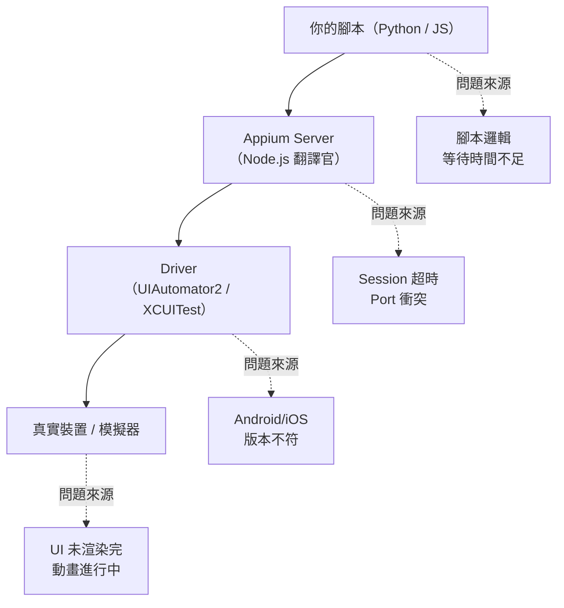
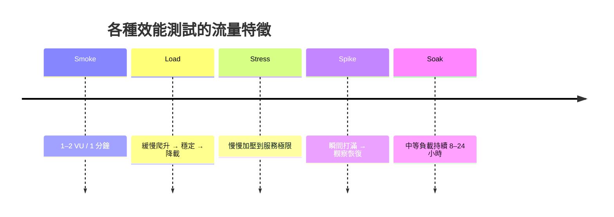
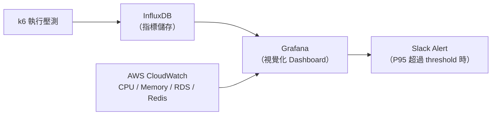
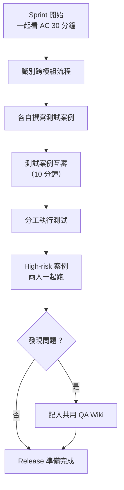
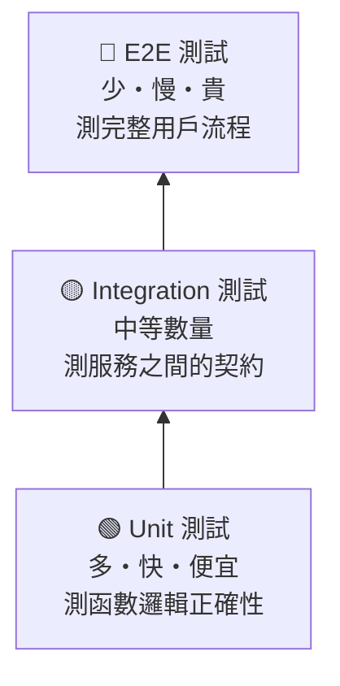
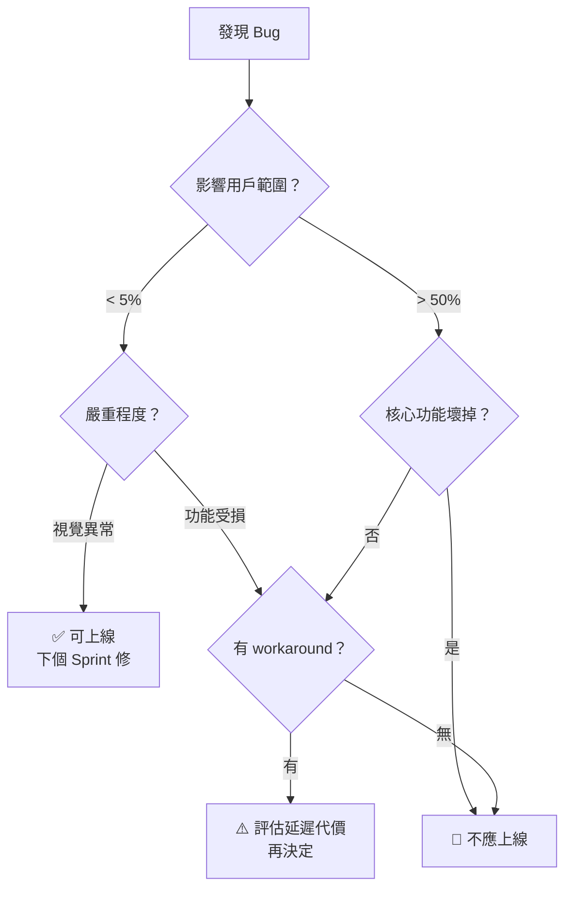

# Mermaid Diagrams Support Design

**Date:** 2026-05-30  
**Status:** Approved

## Goal

Add Mermaid.js diagram support to the blog — both in the public renderer and the TipTap admin editor — then embed specific diagrams into five existing articles.

---

## Sub-project A: Infrastructure

### New Files

#### `src/components/MermaidChart.jsx`

Shared rendering component. Props: `definition: string`.

- Calls `mermaid.initialize({ startOnLoad: false, theme: 'default' })` once (guard with module-level flag)
- Uses `mermaid.render(uniqueId, definition)` in a `useEffect` → injects returned SVG into a `div` ref
- Shows a neutral loading placeholder while rendering
- Shows an inline error message if mermaid throws (invalid syntax)
- Exports only the component; mermaid init is an internal concern

#### `src/components/MermaidBlockExtension.jsx`

Custom TipTap Node extension with a React NodeView for real-time editing preview.

**Node schema:**
- Name: `mermaidBlock`
- Content: inline text (the mermaid source)
- Marks: none
- Group: `block`

**HTML serialization:**
- To HTML: `<pre><code class="language-mermaid">{content}</code></pre>`
- From HTML: parse `pre > code.language-mermaid` → restore as `mermaidBlock` node

**NodeView UI (two-panel layout):**
```
┌────────────────────────────────┐
│  [⬡ Mermaid]  [✕ delete]      │
├────────────────────────────────┤
│  <textarea>  (editable source) │
├────────────────────────────────┤
│  rendered SVG preview          │
└────────────────────────────────┘
```

- `textarea` onChange → debounce 300ms → re-render SVG via `MermaidChart`
- ✕ button calls `deleteNode()` via TipTap NodeView API
- Header label "⬡ Mermaid" is non-editable, serves as drag handle hint

**insertMermaidBlock command:** inserts a mermaidBlock node with a starter template:
```
graph TD
    A[開始] --> B[結束]
```

---

### Changed Files

#### `src/components/MarkdownContent.jsx`

**react-markdown path** — add custom `code` component:

```jsx
function Code({ inline, className, children }) {
  if (!inline && className === 'language-mermaid')
    return <MermaidChart definition={String(children).trim()} />
  return <code className={className}>{children}</code>
}
// Pass to ReactMarkdown: components={{ code: Code }}
```

**HTML path (dangerouslySetInnerHTML)** — add `useRef` + `useEffect` to scan and replace mermaid blocks after mount:

```jsx
const containerRef = useRef()

useEffect(() => {
  if (!isHtml || !containerRef.current) return
  containerRef.current
    .querySelectorAll('pre > code.language-mermaid')
    .forEach(async (el) => {
      const id = `mermaid-${Math.random().toString(36).slice(2, 9)}`
      try {
        const { svg } = await mermaid.render(id, el.textContent.trim())
        const wrapper = document.createElement('div')
        wrapper.className = 'my-6 flex justify-center overflow-x-auto'
        wrapper.innerHTML = svg
        el.closest('pre').replaceWith(wrapper)
      } catch {
        // leave original code block intact on parse error
      }
    })
}, [content, isHtml])

// Attach ref to the HTML-rendered div
```

#### `src/components/RichTextToolbar.jsx`

Add "⬡ 圖表" button to the Insert group (after the Image button):

```jsx
<Btn title="Mermaid 圖表" active={false}
  onClick={() => editor.chain().focus().insertMermaidBlock().run()}>⬡</Btn>
```

#### `src/components/RichTextEditor.jsx`

Add `MermaidBlockExtension` to the extensions array (after `Placeholder`).

---

## Sub-project B: Article Diagrams

Diagrams are embedded as mermaid code blocks immediately after the relevant section in each article file.

### appium-article-revised.md — Appium Architecture

Insert after the "架構" section heading, replacing the existing ASCII art:



### k6-article-revised.md — Two diagrams

**Diagram 1:** After "效能測試不是只有一種" section, after the table:



**Diagram 2:** After "怎麼知道服務是被你打掛的" section, replacing ASCII art:



### qa-team-collaboration.md — Collaboration Workflow

Insert after "現在怎麼協作" heading:



### unit-test-100-but-qa-finds-bugs.md — Testing Pyramid

Insert after "測試金字塔的真正意義" heading:



### when-to-ship.md — Bug Severity Decision Tree

Insert after "我用來判斷的框架" heading:



---

## Package Requirements

- `mermaid` — already a browser-standard library, install via npm
- No additional TipTap packages needed (NodeView uses `@tiptap/react` already installed)

```bash
npm install mermaid
```

---

## Out of Scope

- Mermaid syntax validation in the editor (rely on mermaid's own error)
- Dark mode theming for diagrams
- Export diagram as image from editor
- Mermaid in the public page's SEO / og:image
