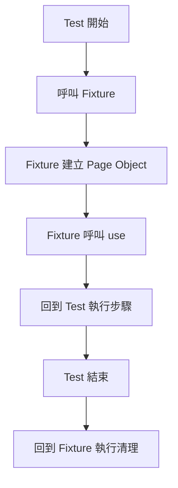
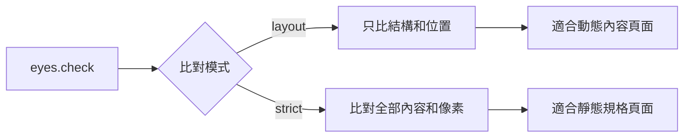
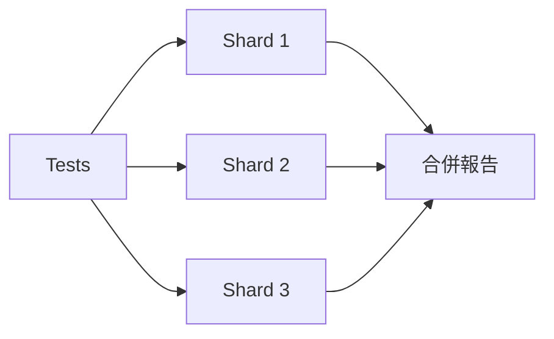

# Playwright 進階：讓測試從能跑，變成團隊敢信任的東西

一個測試套件能跑，和一個測試套件讓人放心，是兩件完全不同的事。

前者是「有測試」，後者是「有效的測試」。很多團隊卡在中間——CI 跑了，但沒人確定測試真的涵蓋了關鍵場景；速度太慢大家不想等；測試環境共用帳號導致 flaky；資料沒有隔離，今天跑過明天跑不過。

這篇是我上完 Test Automation University *Playwright Advanced* 課程的筆記。講師是 Renata Andrade，課程不教基礎語法，而是在教——**怎麼讓 Playwright 測試真正融入開發流程**。

---

## 課程概覽

| 項目 | 內容 |
|------|------|
| 課程名稱 | Playwright Advanced |
| 平台 | Test Automation University（免費） |
| 講師 | Renata Andrade |
| 章節 | 7 章 |
| 技術棧 | TypeScript + Playwright |

---

## 第一關：登入優化——別讓每個測試都重新登一次

Playwright 進階課的第一章就切中一個所有人都碰過的問題：

**每個測試都從頭登一次，浪費的時間到底有多多？**

課程用數字說話：同樣的測試，用 storageState 重用登入狀態後，執行時間從 **10.8 秒降到 4.2 秒**——縮短超過一半。一個測試如此，一百個測試就是幾分鐘的差距。

### storageState 的三種用法

**1. Global Setup（單一帳號）**

在 `playwright.config.ts` 設定 `globalSetup`，在 CI 啟動時執行一次登入，把登入狀態存成 JSON，之後所有測試直接讀取這個檔案，不重新登入。

```ts
// playwright.config.ts
export default defineConfig({
  globalSetup: './tests/setup/global-setup.ts',
  use: { storageState: '.auth/storageState.json' }
})
```

**2. Multi-role Auth（多角色）**

有多種角色（admin / user）時，改用 `project` 依賴：auth-setup 先跑，為每個角色各自存一個 JSON，後續的 spec 各自指定用哪個角色的狀態。

**3. API Auth（最快）**

直接用 `request.post` 打登入 API，跳過 UI 整個流程，登入時間幾乎歸零。只要應用程式的登入 API 穩定，這是最值得採用的方式。

```ts
// global-setup.ts 用 API 登入
const response = await request.post('/api/login', {
  data: { username, password }
})
await request.storageState({ path: '.auth/user.json' })
```

**QA 視角的觀察**：登入是幾乎每個 E2E 測試的前置步驟，但它不是測試的目的。把它從每個 test 裡抽掉，測試才能專注在它真正要驗的東西上。

---

## 第二關：Fixtures——讓測試程式碼可以被「組合」

課程的第二個重點是 Fixtures，但我覺得真正的重點不是語法，而是**思維轉換**。

Hooks（beforeEach）是「在測試前做什麼」，Fixture 是「把準備和清理包裝成一個可複用的流程單元」。



Fixture 的 `use()` 就是一個執行的分水嶺：`use()` 之前是 setup，`use()` 之後是 teardown。測試本身夾在中間，完全不用知道前後發生了什麼。

**為什麼這對 QA 有意義？**

當測試需要在某個「乾淨狀態」下執行（資料清空、用戶重置、快取清除），Fixture 讓你不用在每個 spec 裡重複寫這些準備步驟。你只需要：

```ts
test('Add new book', async ({ bookPage }) => {
  // Fixture 已經在背後清空書單，直接進測試
  await bookPage.goto('books/new')
  await bookPage.addToCollection()
})
```

---

## 第三關：在測試裡直接打 API——不只是加速，是隔離

Chapter 3 和 4 講的是 API 互動，但我覺得它要解決的核心問題只有一個：**測試資料的狀態控制**。

### 為什麼要在 E2E 測試裡打 API？

典型場景：你有一個「加入購物車」的 E2E 測試，但每次跑之前需要確保購物車是空的。

如果你透過 UI 清空，要點好幾個步驟，而且清空本身也可能有 bug。如果你直接打 API 清空，一行搞定，不依賴 UI，也不會因為清空功能本身有問題而影響你真正要測的東西。

### APIRequestContext

Playwright 的 `APIRequestContext` 讓你在測試內直接發 HTTP 請求：

```ts
// beforeAll 建立 API 連線
apiContext = await playwright.request.newContext({
  baseURL: 'https://your-api.com',
  extraHTTPHeaders: {
    Authorization: `Basic ${Buffer.from(`${user}:${pass}`).toString('base64')}`,
    Accept: 'application/json',
  }
})

// 測試內用 API 清空資料
await deleteAllBooksByUser(apiContext, userId)
```

### 攔截 API 回應（Request Interception）

更強的用法是攔截並偽造 API 回應：

```ts
await context.route(/Account\/V1\/User/, (route) => route.fulfill({
  body: JSON.stringify({ books: [mockBook1, mockBook2] })
}))
```

這讓你可以測試「第三方服務掛掉時，UI 的行為」——你無法控制真實的外部 API，但可以攔截它、替換成你要的回應，驗證你的應用程式處理異常的方式是否正確。

**注意**：課程有提醒，mock API 回應意味著你繞過了真實的整合，要謹慎使用——它適合測試前端的錯誤處理行為，不適合拿來替代真正的整合測試。

---

## 第四關：資料管理——測試獨立性才是真正的目標

課程整理了五種資料來源：

| 資料方式 | 適合用途 | 注意事項 |
|---------|---------|---------|
| `.env` 檔 | 敏感資料（帳密、token） | 加入 `.gitignore`，CI 用 Secrets |
| JSON 檔 | 結構化的測試資料、多環境設定 | 可依 env 切換不同值 |
| API 請求 | 測試前後的資料 setup/teardown | 比直接改 DB 安全，保有資料驗證邏輯 |
| API 攔截 | 模擬外部服務異常 | 只用於 UI 錯誤處理場景 |
| CSV 檔 | 大量參數化測試資料 | 用 `fs` 讀取後轉 object 迭代 |

課程強調：優先用 API 操作資料，而不是直接連資料庫。原因是 API 有驗證邏輯，直接改 DB 可能讓資料進入一個「業務上不可能出現的狀態」，這樣的測試前提本身就有問題。

---

## 第五關：Visual Regression——功能測試看不到的，它看得到

Chapter 5 介紹 Applitools 視覺測試，但我想從一個更普遍的角度談視覺回歸的價值。

功能測試告訴你「按鈕可以點、表單可以送出、資料可以顯示」。視覺測試告訴你「畫面看起來是不是對的」。

這兩件事不一樣。

你可能有一個按鈕，功能完全正常，但因為某個 CSS 改動，在某個畫面尺寸下它跑到螢幕外面，用戶根本看不到它。功能測試不會抓到這個，視覺測試會。

課程介紹了兩種比對模式：



**layout 模式**：只檢查元素的位置和版型，不管內容。適合「有動態資料」的頁面——今天書單可能有 3 本，明天有 5 本，但版型應該要正常。

**strict 模式**：內容和像素都要完全一致。適合「內容固定」的頁面，例如 API 文件、法律條款、定價頁。

---

## 第六關：CI 整合——測試不進 pipeline，就不算存在

最後一章講 CI，課程用 GitHub Actions 示範，但概念適用所有 CI 工具。

### 幾個值得注意的點

**Slack 通知**：測試跑完主動通知團隊，不用等人主動去看報告。特別是在「E2E 測試剛導入、還不穩定」的階段，pipeline 可能不設定 fail-on-error，但 Slack 通知讓失敗訊息不會被忽略。

**Sharding（分片執行）**：把測試分散到多台機器並行跑。課程特別提醒一個反直覺的事：**機器數量不是越多越好**。因為每台機器都需要安裝依賴和瀏覽器，安裝時間固定存在。你需要實驗找到最適合你的測試套件的機器數量。



**環境變數管理**：敏感資料（API token、帳密）放 GitHub Secrets；非敏感的環境設定（ENV=staging）放 Variables。Secrets 在 log 裡會被遮罩，Variables 會明文顯示。

---

## 我的總結

這門課讓我最有收穫的概念是「測試套件也需要被維護」。

初期寫測試，能跑就行。但當測試變多、測試速度拖慢 CI、flaky 測試開始出現、新人加入不知道從哪裡開始——這些都是「能跑」的測試還是「有負擔」的測試的分水嶺。

課程介紹的這些進階技巧，每一個都在解決一個實際問題：

- **Auth 優化** → 測試不再因為登入而慢
- **Fixtures** → 測試邏輯和基礎設施分離，新增測試變容易
- **API 互動** → 資料狀態可控，測試可重複執行
- **資料管理** → 環境切換不需要改程式碼
- **Visual Regression** → 功能測試的盲點被補上
- **CI + Sharding** → 測試真的跑進交付流程裡

一個讓整個團隊敢信任的測試套件，需要在這六個維度都做到及格以上。

---

課程連結：[TAU - Playwright Advanced](https://testautomationu.applitools.com/playwright-advanced/)

---

## 參考資料

- [Test Automation University — Advanced Playwright](https://testautomationu.applitools.com/playwright-advanced/) — 本文課程來源
- [Playwright — Official Documentation](https://playwright.dev/docs/intro) — Playwright 完整官方文件
- [Playwright — Authentication](https://playwright.dev/docs/auth) — storageState 與 auth 設計說明
- [Playwright — Fixtures](https://playwright.dev/docs/test-fixtures) — Fixtures 機制詳細文件
- [Playwright — API Testing](https://playwright.dev/docs/api-testing) — APIRequestContext 使用指南
