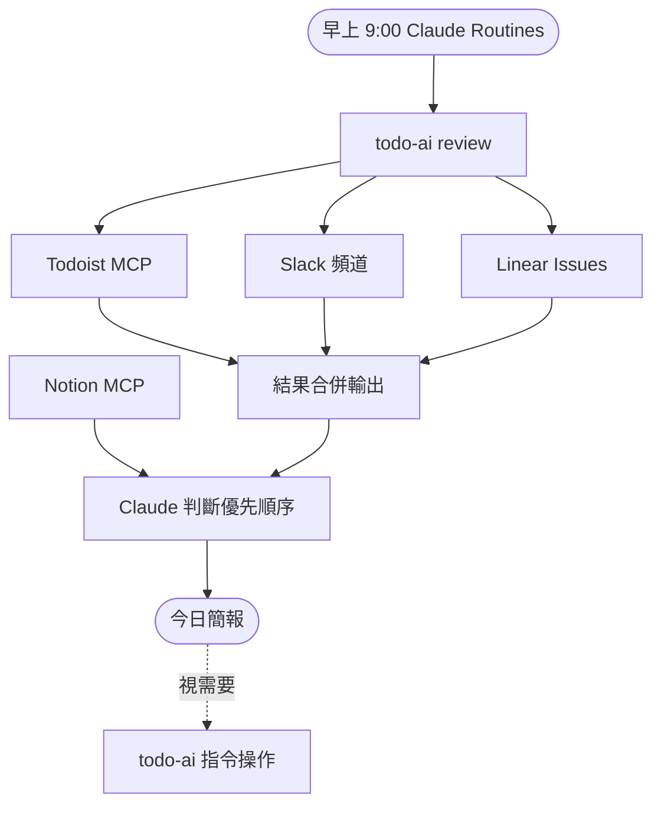

# 用一個指令整合三個工具：我的每日工作流實作

每天早上最浪費的那段時間，不是開會，是切頁籤。Todoist 看今天要做什麼，Slack 看 #ops 有沒有緊急事，Linear 確認有沒有新 issue 分進來。三個工具，三次切換，還沒正式開工，注意力已經碎了一輪。

這個習慣維持了快一年。不是不覺得浪費，是覺得「這種事本來就這樣」。直到某天我想說，這三件事都是讀資料，沒有一件需要手動——為什麼還要自己切頁籤？

解法是一個 CLI，叫 `todo-ai`。一個指令把三個來源的資訊拉出來：

```
$ todo-ai review

Daily Work Review (2026-06-27T09:00:00.000Z)

Todoist overdue
- [abc123] P1 確認 API 測試報告 (2026-06-26) #QA

Todoist today
- [def456] P2 Review Max 的 PR #QA
- [ghi789] 更新測試文件 #Documentation

Todoist upcoming
- [jkl012] P3 準備週五 demo 的測試案例 (2026-06-29) #QA

Slack #ops
- 部署延遲: Staging 今早 10:30 部署失敗，Max 正在處理 Owners: Max

Linear assigned to me

In Progress
- [QA-42] P2 自動化測試覆蓋率分析 #QA-Platform

Todo
- [QA-38] API 回歸測試腳本重構 #QA-Platform
```

第一次跑通的時候，老實說有點傻眼。不是因為很難做到，而是做到之後才意識到，這件事根本可以更早解決。

頁籤不用切，OAuth 不用登三次。一個指令，今天要做什麼、有沒有漏接、有沒有新 issue，全在這裡。

背後的結構不複雜。Todoist 用官方 MCP server（`https://ai.todoist.net/mcp`），CLI 直接連過去查詢。Slack 和 Linear 各自設定一次 MCP connector，存在本地 config 檔，之後不用再動。三個 source adapter 各自查詢、各自格式化，`review` 把結果合在一起印出來。

哪個 source 沒設定，`review` 還是會跑，只是那個區塊印 `unavailable: authentication required`，不會整個爆掉。

整個工作流長這樣：



`review` 之外，日常操作也都在這個 CLI 裡：

```bash
todo-ai add "下午三點前回覆 Max 的問題"   # 新增任務
todo-ai today                              # 只看今天
todo-ai overdue                            # 只看過期
todo-ai complete abc123                    # 完成任務
todo-ai postpone abc123 tomorrow           # 延期
todo-ai priority abc123 1                  # 調優先級
```

Todoist app 不用開，頁面不用切。看到任務要處理，在 terminal 做完，繼續做別的。

## 搭配 Claude Routines 自動化

`todo-ai review` 的輸出是純文字，可以直接當 AI 的輸入。我把這件事接到 Claude Routines，設一個每天早上九點的排程：

```
每天早上 9:00：
1. 執行 todo-ai review
2. 根據輸出，判斷今天優先順序
3. 如果有過期任務，提醒處理
4. 如果 Slack #ops 有未解決的事，標記出來
5. 查 Notion 看今天有沒有相關測試計畫或文件要參考
```

Notion 不在 `todo-ai` CLI 裡，它是透過 Claude 的 MCP 接進來的。`todo-ai` 拉任務和 issue，Notion MCP 查知識庫，Claude Routines 把兩邊合在一起判斷。分工是刻意的：結構化資料給 CLI 管，模糊的文件查詢讓 Claude 來做。

早上開電腦，Claude 那邊已經跑完了。需要調整任務，再用 `todo-ai` 指令操作。

用了一陣子之後，真正的差別不在省了幾分鐘，是進入工作狀態的方式變了。以前是「我要去確認狀況」，現在是「狀況已經在那裡等我」。這兩種感覺很不一樣。

## 還沒解決的部分

Slack 目前只讀 `#ops`。頻道多的話就會漏東西，config 可以設多個 channel，但還沒做。

工具串起來之後，早上第一件事從「決定要看什麼」變成「直接看結果」。省下的不只是時間，是注意力。
