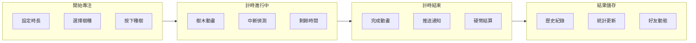
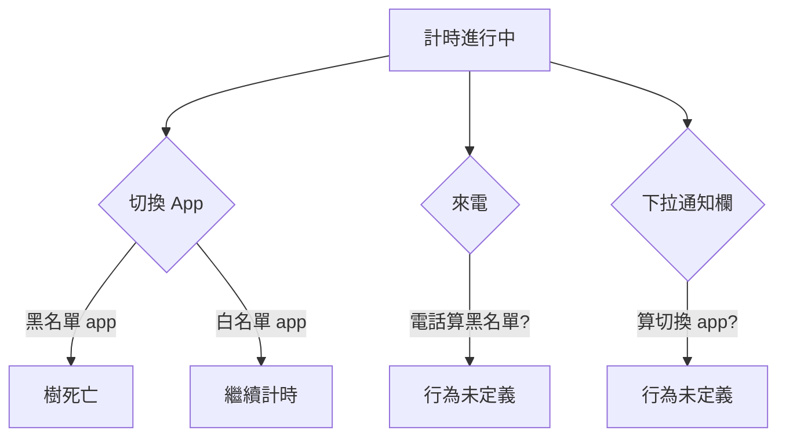
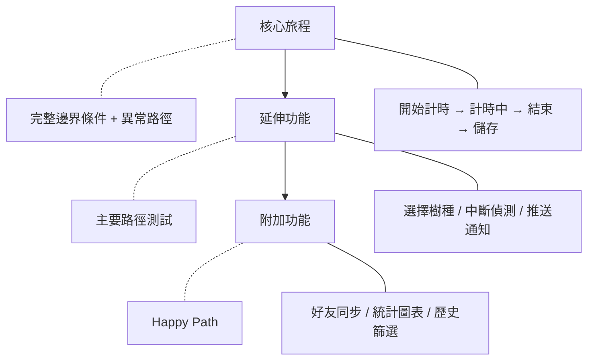

# 拿到票單的時候，QA 已經輸了

每次 sprint planning 結束，QA 拿到一份 User Story 清單，然後開始想：要怎麼測？從哪裡開始？什麼是完成的定義？

問題不在清單太短或太長。問題是——**清單這個格式，根本不適合用來理解一個功能到底長什麼樣子。**

User Story Mapping（使用者故事對照）解決的是這個問題。它把所有故事攤開成一張地圖：橫軸是使用者的行為流程，縱軸是每個行為底下的細節和優先順序。一眼看去，你不只看到「有哪些票」，你看到「整個系統的輪廓」。

這篇文章不是在介紹 USM 是什麼，而是想說——對 QA 來說，Story Mapping 有三種比你想像中更有價值的用法。

我用 **Forest**（番茄鐘專注 app，種虛擬樹的那個）當例子貫穿整篇，因為它的核心功能看起來很簡單，展開之後複雜得出乎意料。

---

## 用法一：在開發前，用地圖把「完成的定義」說清楚

QA 最常遇到的情況：開發完成，進入測試，才發現對「完成」的定義根本不一樣。

> 「種樹按下去就完成了。」
> 「不對，樹要長完才算完成。」
> 「樹長完之後要進歷史紀錄才算完成。」
> 「歷史紀錄要顯示正確的時長才算完成。」

這四句話對應的是同一個功能——**Forest 的種樹流程**。但在票單裡，這個流程只有一張票：「使用者可以開始一個專注計時」。

Story Mapping 把這個流程攤開之後，長的是這樣：

這張圖讓 QA 在 sprint 開始前就能問：

- **「中斷偵測」這一欄，判定中斷的條件是什麼？切換 app？接電話？螢幕關掉？」**
- **「同步好友動態要同步嗎？這個版本包含嗎？」**
- **「通知推送失敗的話，樹算種成功還是失敗？」**

這些問題不是 QA 特別敏感，而是因為 QA 在看地圖時，天然地會從「什麼情況下這一格會壞掉」的角度掃描。

**QA 在 Story Mapping 會議時做的事，不是坐在後面等討論結束。是在每一格旁邊貼上「這裡的驗收條件是什麼？」**

這比事後寫 test case 有效十倍——因為你在定義「完成」，不是在驗證「完成」。

---

## 用法二：用地圖看見票單看不到的 Edge Case

清單格式有個盲點：它讓每個故事看起來彼此獨立。

但使用者的行為不是獨立的。

Forest 的「黑名單 app」功能，用清單描述很簡單：「使用者可以設定在專注期間封鎖特定 app」。但把它放回完整的地圖裡，你會看到它和其他旅程的交叉點：

這些交叉點在票單裡是隱形的。「封鎖 app」的票不會提到「接電話」，因為寫票的人沒想到那是同一個脈絡。

Story Mapping 把所有使用者行為並排之後，QA 看到的不只是每一格的內容，而是**格與格之間的縫隙**。

縫隙裡住著最多 bug。

我在實際工作中用這個方法時，常做的事是在 Mapping 完之後，專門花半小時「找交叉點」：哪些功能在某個使用者旅程的中途會被觸發？觸發時，系統應該怎麼反應？有沒有人把這個寫清楚？

通常答案是：沒有。但找到它的時機是開發前，代價是討論十分鐘，不是上線後的緊急修 bug。

---

## 用法三：用地圖決定「這個版本要測多深」

QA 的資源有限。不是每個功能都需要一樣的測試深度。

Story Mapping 的縱軸天然地提供了一個優先順序：越靠上的故事是核心旅程，越靠下的是「有就好」的細節。這個結構直接告訴 QA 應該把力氣放在哪裡。

以 Forest 第一個版本為例：

這個切法讓 QA 可以很具體地跟 PM 說：

**「核心旅程我會跑完整的邊界條件和異常路徑，延伸功能跑主要路徑，附加功能只驗 happy path。你同意這個 scope 嗎？」**

這不是在降低品質，是在把品質放在最有價值的地方。

如果沒有 Story Map，QA 只有一張清單，沒有依據說「這個比那個重要」。每個需求在清單上長得都一樣大，結果是重要的測淺了、不重要的反而測深了。

有了地圖，測試的深度有根據，可以溝通，可以調整，不再是 QA 自己悶頭猜。

---

## QA 應該在 Story Mapping 會議裡嗎？

這個問題的答案是：不只應該在，而且應該是**最早提問的那個人**。

開發工程師在 Story Mapping 想的是「這個功能怎麼做」，PM 想的是「這個功能要不要做」，設計師想的是「這個功能怎麼長」。

QA 想的是：**「這個功能在什麼情況下會讓使用者體驗到問題？」**

這個視角在開發前是最便宜的，在上線後是最貴的。

Story Mapping 提供的不只是一張圖，而是一個讓所有人在同一個時間點、對同一個視角達成共識的機會。QA 在那個時間點進入，帶來的是「破壞視角」——不是要破壞討論，而是要在產品做出來之前，先把可能壞掉的地方說出來。

這比事後寫測試計畫有價值。因為事後你在的時候，決策已經定了。

---

## 總結

User Story Mapping 對 QA 的三種用法：

1. **在開發前用地圖定義「完成的定義」**——不讓驗收標準在最後才討論
2. **用地圖找票單看不見的 edge case**——格與格之間的縫隙就是 bug 的藏身處
3. **用地圖決定這個版本要測多深**——讓測試深度有根據、可溝通

如果你的 QA 角色一直是「接到票單才開始工作」，Story Mapping 可能是讓你往前移動半個 sprint 的工具。

值得試試。

---

## 參考資料

- [Jeff Patton — User Story Mapping](https://www.jpattonassociates.com/user-story-mapping/) — User story mapping 方法論原創者，本文概念來源
- [Mike Cohn — User Stories Applied](https://www.mountaingoatsoftware.com/books/user-stories-applied) — Agile 需求寫作與 QA 配合的標準參考書
- [Elisabeth Hendrickson — Explore It!](https://pragprog.com/titles/ehxta/explore-it/) — 探索式測試與需求理解的實踐方法
- [Agile Alliance — Three Amigos](https://www.agilealliance.org/glossary/three-amigos/) — Three Amigos 會議定義與實踐指南
- [ISTQB — Agile Tester Extension](https://www.istqb.org/certifications/agile-tester) — 敏捷測試師認證中的需求分析章節
